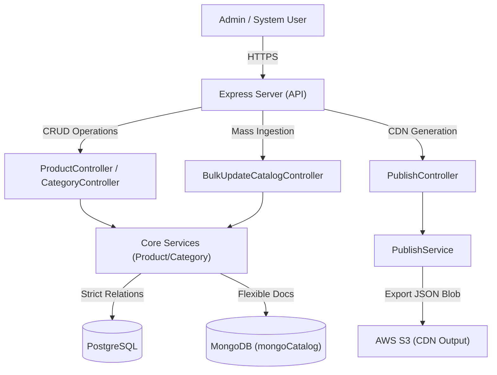
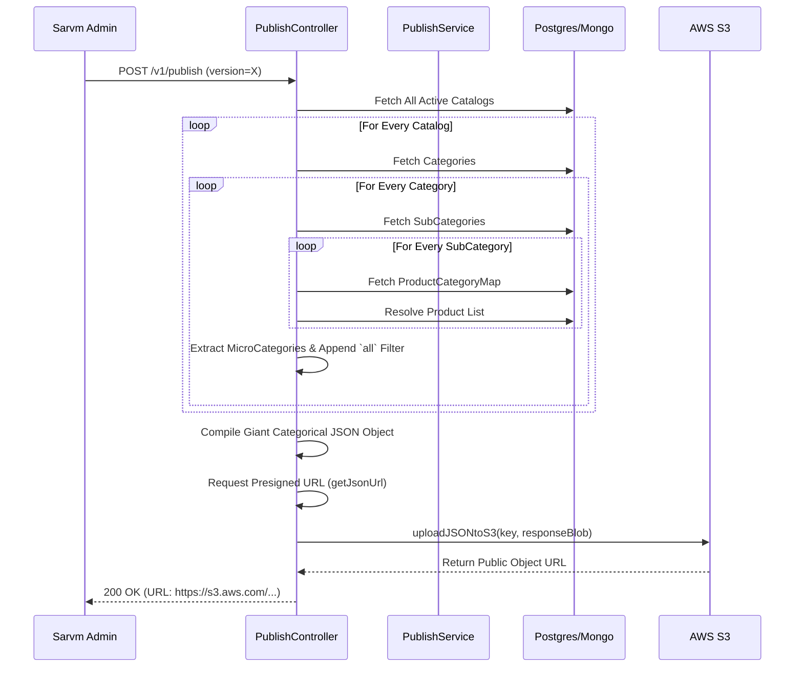
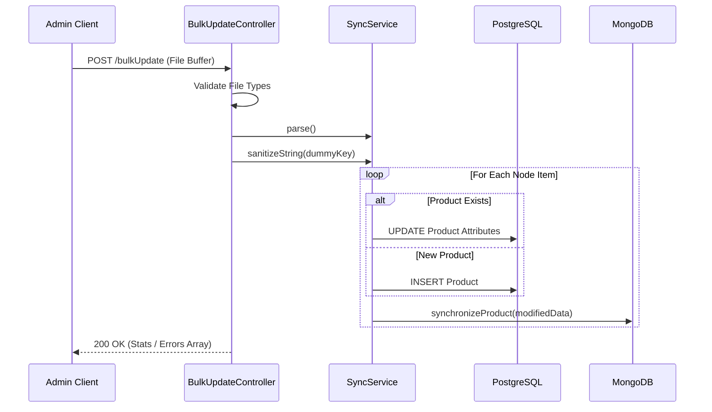

# Catalogue Management Service - Architecture & Workflows

**Project**: Catalogue Management Service
**Organization**: SARVM AI
**Stack**: Node.js, Express.js, PostgreSQL (Relational Master), MongoDB (Document Store), AWS S3

---

## 1. Executive Summary

The **Catalogue Management Service** acts as the central Product Information Management (PIM) system for the SARVM ecosystem. Unlike transaction-focused microservices written in Java/Spring Boot (Payment/Wallet), the Catalogue service is highly read-optimized, written in Express.js.

It fundamentally creates and manages a global **Master Catalogue** tree (Catalog -> Category -> MicroCategory -> Products). It also supports massive Data Ingestion workflows (Bulk Updates) and effectively functions as a static site generator by "publishing" complex JSON payload structures directly to AWS S3, thereby offloading global read operations from the database to highly scalable CDNs.

## 2. System Architecture

The service runs a unique Polyglot Persistence architecture, utilizing both SQL for strict relations and NoSQL/S3 for flexible complex hierarchies.

### Architecture Diagram



- **Routing Layer**: Express routers map `/v1/catalog`, `/v1/product`, `/v1/publish` directly to specialized controllers.
- **Service Layer**: Decoupled models holding raw business logic for fetching IDs, resolving parent-child mappings, and cleaning strings.
- **Dual Persistence Strategy**: Primary product associations live in PostgreSQL. However, flexible large-scale arrays and synced views live in MongoDB (`mongoModels` / `mongoCatalogService`). 
- **CDN Publishing (`publish.js`)**: Converts massive multi-joined data trees into raw JSON, pushes it directly to an S3 Presigned URL, allowing client apps to fetch complex nested data inherently instantly via AWS Object Storage rather than querying databases for millions of API calls.

## 3. Data Flow Workflows

### Workflow 1: Dynamic Catalogue Tree Construction (Static CDN Compilation)

This workflow outlines how the system recursively maps products and outputs them to an external high-speed JSON host via S3 (`publish.js`).



### Workflow 2: Catalog Bulk Ingestion

Flow for parsing massive CSV/Excel sheets into normalized database environments.



## 4. Tech Stack

- **Platform**: Node.js
- **Framework**: Express.js
- **Persistence 1**: PostgreSQL (Sequelize/Raw SQL)
- **Persistence 2**: MongoDB (Mongoose Schema mapping)
- **External Dependencies**: Axios, ShortUniqueID, Mongoose, AWS-SDK
- **Formatting/Linting**: ESLint, Prettier

## 5. Project Structure

```text
catalogue_mgmt_service/
├── .env / .dev.env / .prd.env     # Environment segregations
├── package.json                   # Node modules map
├── server.js                      # Application instantiation
└── src/
    ├── InitApp/                   # Express App & Middlewares config
    ├── apis/
    │   ├── controllers/v1         # Express Request Handlers
    │   ├── services/v1            # Domain Logic (Category, UploadDoc, publish)
    │   ├── db/                    # SQL Mappings & Migrations
    │   ├── db_meta/               # Metadata DB instances
    │   ├── mongoModels/           # Mongoose schemas
    │   └── routes/                # Express Route Endpoints
    ├── common/                    # Generic utilities (S3 uploaders, Loggers)
    └── scripts/                   # Migration or DB Seed Scripts
```

## 6. Core Functionality

- **Hierarchical Classification**: Models deep parent-child links: `Catalog` -> `Category` -> `SubCategory` (MicroCategory)-> `Product`.
- **Hybrid Data Generation**: Instead of traditional API polling, caching relies entirely on massive periodic S3 Data pushes, dramatically accelerating startup rendering on the consumer-facing apps.
- **Short UUIDs**: Leverages `shortUniqueId` (`createUniqueKey.js`) natively providing robust URL-friendly short IDs for catalogues avoiding long clunky UUIDs or predictable Sequence integers.
- **Polyglot Synchronization**: Updates to `Catalog.js` automatically sync across into the MongoDB pipeline (`mongoCatalogService.addBulkCatalog(modifiedData)`).

## 7. APIs & Integrations

**Controllers & Routes Available**:
- **`/v1/catalog`**: Standard CRUD (Add, List, SoftDelete).
- **`/v1/bulkUpdateCatalog`**: Bulk updates by parsing files / JSON payloads natively mapping columns to system constraints.
- **`/v1/publish`**: Static compiler triggering the map-reduce iteration outputting an AWS S3 URL.
- **`/v1/retailerCatalog`**: Endpoints isolated for scoping catalogues to isolated shops ensuring a generic system catalog can be derived per tenant.

**External Network**:
- `AWS S3`: Presigned URL fetching and mass JSON blob dropping.

## 8. Database Design

1. SQL Tables:
   - **Catalogs**: Identifiers, tax statuses, visual elements.
   - **Categories**: Parent-Child relationships natively.
   - **Products**: SKUs, descriptions, pricing mappings.
   - **ProductCategoryMappings**: Many-To-Many bridging.
2. NoSQL Mongo Documents:
   - **MongoCatalog**: Flat, deeply indexed document records optimizing arbitrary filtering outside traditional SQL joins. 

## 9. Setup & Installation

Ensure you have Node.js and PostgreSQL/MongoDB setups globally.
1. Map environment variables (or copy `.env.example` -> `.env`).
2. Deploy the application locally:
   ```bash
   npm install
   npm run start:dev
   ```

## 10. User Flow

1. Admin acquires a standardized Excel sheet of 500 new FMCG Products.
2. Admin utilizes the `/v1/bulkUpdateCatalog` endpoint. The Node server sanitizes arrays, auto-generates internal ShortUniqueIDs, and persists dual bindings in Postgres/Mongo.
3. System hits the `/v1/publish` hook automatically or manually.
4. The service maps 6 levels deep, compiling all 500 products into an S3 `.json` repository. 
5. The Retailer App fetches the `.json` directly from the AWS CloudFront/S3 edge node natively caching all catalogues without burning SARVM DB resources.

## 11. Edge Cases & Limitations

- **Publish Operation Blocking**: The `publish.js` map algorithm does not currently utilize Worker Threads (`child_process`). Its massive nested map loops (`for let catalog of catalogs... await...`) can severely block the generic Node.js Event Loop halting other `/catalog` traffic during compilation.
- **Split Brain Storage**: Data mutation across PostgreSQL and MongoDB simultaneously carries massive risks of "Split Brain" inconsistency if a service crashes mid-flight without strict dual-commit logic (Saga Pattern or 2PC).

## 12. Performance & Scalability

- **S3 Render Extrapolation**: Publishing highly nested data into static endpoints reduces active Server throughput demands globally by 99% for active users fetching catalogs. 
- **Weakness**: Node.js V8 execution blocks if an array inside `publish.js` scales to 1,000,000 products natively. 

## 13. Future Improvements

1. **Async Queue Workers**: Offloading `publish.js` and `bulkUpdateCatalog.js` to a queue network (like BullMQ + Redis) removing long-running HTTP blocks off the primary thread.
2. **GraphQL Transition**: Implementing GraphQL strictly to replace deeply nested hardcoded Map/Reduce sequences in the publish controllers allowing customized data fetches inherently.
3. **Optimistic Pre-computation**: Emitting AMQP/Kafka events upon distinct Product saves rather than mass-recompiling the entire tree.

## 14. Summary

The Catalogue Management Service operates fundamentally differently from the internal Java ledgers. As a Node System, it focuses on hyper-fast manipulation of hierarchical arrays, and uniquely offloads high-read network pressure by physically publishing the catalog to S3 buckets, operating as a functional Static API Compiler.
