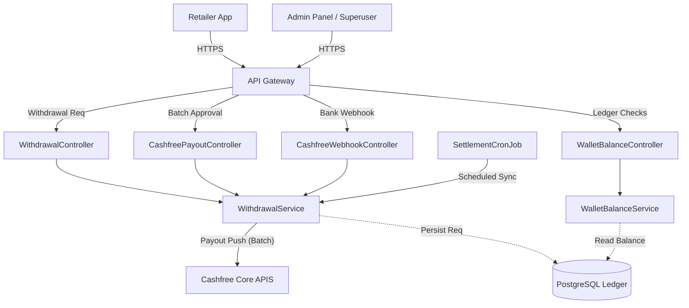
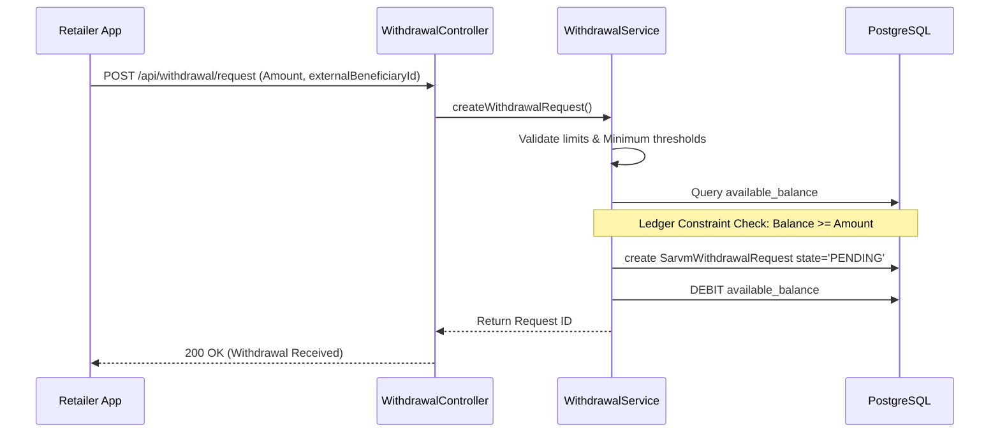
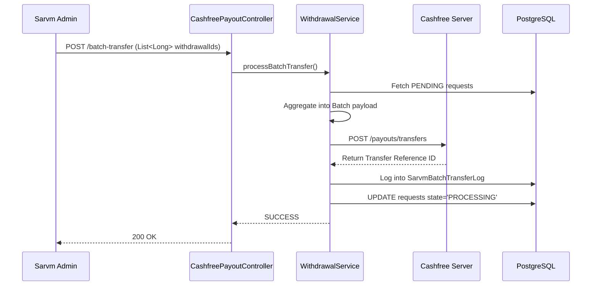
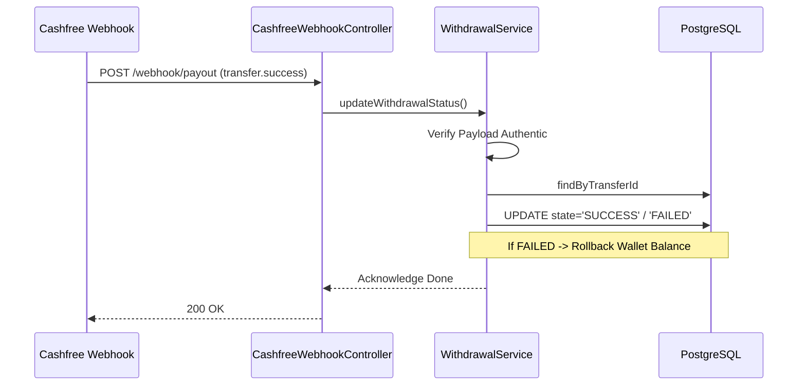

# Wallet Service - Core Architecture & Workflows

**Project**: Wallet Service (Underlying Package: *ReferralAndRewardApplication*)
**Organization**: SARVM AI
**Stack**: Spring Boot, Java 11, PostgreSQL, Cashfree SDK

---

## 1. Executive Overview

The **Wallet Service** operates as the central financial ledger module for the SARVM ecosystem, chiefly managing retailer balances, rewards, and settlements. Distinct from the generic *Payment Service* (which focuses on incoming consumer fund capture via Razorpay), the Wallet Service orchestrates the **outgoing settlement lifecycle**.

By leveraging the **Cashfree Payouts API**, it processes bulk withdrawals, records multi-tenant ledger adjustments (`WalletBalance`), correlates refunds, simulates pricing config, and handles incoming async acknowledgments from banking networks guaranteeing funds landed in a retailer's localized account.

## 2. System Architecture

The service introduces highly specialized functional segregation for payouts over standard Spring Boot MVC.

### Architecture Diagram



- **Routing Layer**: Exposes withdrawal hooks (`/api/withdrawal/request`), payout executions (`/admin/payouts/batch-transfer`), and pure ledger readouts (`/balance/`).
- **Integration Layer**: Switches from Razorpay to **Cashfree** specifically since Cashfree specializes in B2B *Payouts* acting as the ultimate settlement proxy.
- **Service Layer**: Evaluates withdrawal constraints, formulates batch transfers, and securely recalculates ledger sums.

## 3. Data Flow Workflows

### Workflow 1: Withdrawal Request Lifecycle (Retailer -> Pending)

Workflow detailing how retailers request liquidity against their internal `available_balance`.



### Workflow 2: Admin Batch Execution (Pending -> Processing)

The operations block executed by SARVM Admins compiling multiple withdrawal requests and releasing them onto the banking network.



### Workflow 3: Asynchronous Banking Settlement (Processing -> Success)

Closing the loop securely once the banking networks actually clear the NEFT/IMPS transfer securely directly into the Retailer's bank.



## 4. Tech Stack

- **Core**: OpenJDK 11, Spring Boot
- **Persistence**: PostgreSQL paired with Spring Data JPA
- **Payout Gateway**: Cashfree Payout SDK / Retrofit client integrations
- **Logging**: SLF4J, SarvmBatchTransferLog auditing

## 5. Project Structure

```text
src/main/java/com/sarvmai/referralreward/
├── controller/        # Handlers (Withdrawal, CashfreePayout, RestController)
├── service/           # WithdrawalService, Settlement logic, Cashfree Wrappers
├── entity/            # Ledger models (SarvmWithdrawalRequest, SarvmBatchTransferLog)
├── repositories/      # Spring Data configurations for PGSQL
├── enums/             # Transaction status maps (PENDING, PROCESSING, SUCCESS)
├── cron/              # Asynchronous syncing and reconciliation algorithms
└── exception/         # Thresholds, Invalid amounts, Balance constraints
```

## 6. Core Functionality

- **Ledger Constraints**: Guarantees withdrawal requests natively lock/debit internal wallet tables (`available_balance`) explicitly stopping double-spend problems.
- **Batch Optimization**: Avoids expensive sequential HTTP calls by employing Cashfree batch-transfers, greatly optimizing Admin workflows.
- **Payout Reconciliation**: Robustly processes `webhook/payout` allowing the state to move dynamically without active user polling.
- **Rollbacks**: Reverses the internal database debits if Cashfree returns a `transfer.failed` webhook, guaranteeing eventual ledger accuracy.

## 7. APIs & Integrations

**Exposed Endpoints**:
- `POST /api/withdrawal/request` - Initiate local ledger deduction.
- `GET /api/withdrawal/{retailerId}/balance` - Wallet balance query.
- `POST /admin/payouts/batch-transfer` - Restricted route for operations to process bulk payments out to Cashfree.
- `POST /api/cashfree/webhook/payout` - System hook ingestion mapping successful transfers.

**External Network**:
- `api.cashfree.com/payout/transfers` - Direct connection to banking gateways (IMPS/NEFT routing).

## 8. Database Design

Key Entity Interplay:
1. **Wallet Accounts**: Core ledger defining standard `available_balance`, `withdrawable_balance`, `frozen_balance`.
2. **SarvmWithdrawalRequest**: Captures ID, Amount, Beneficiary ID, `status` (PENDING | PROCESSING | SUCCESS | REJECTED).
3. **SarvmBatchTransferLog**: Records the precise compilation payload sent to Cashfree. Crucial for financial debugging.

## 9. Setup & Installation

Ensure you have Java 11 and PostgreSQL setup locally.
1. Configure `.env` with:
   - `spring.datasource.url` 
   - `CASHFREE_CLIENT_ID` / `CASHFREE_CLIENT_SECRET` (Fetch Sandbox credentials from Payout Dashboard)
2. Deploy the application:
   ```bash
   mvn clean install
   mvn spring-boot:run
   ```

## 10. User Flow

1. Retailer builds up earnings through the App.
2. Retailer checks their `WithdrawalController` endpoints finding `₹500` available.
3. Retailer taps "Withdraw" mapping to their saved `externalBeneficiaryId`.
4. App hits `/withdrawal/request`, deducting the `₹500` from their virtual wallet immediately enforcing scarcity.
5. Internal Admin eventually audits the pending block and clicks "Approve Transfers" (Hitting `/batch-transfer`).
6. Cashfree triggers a banking transfer.
7. Milliseconds/Minutes later, Cashfree executes `/webhook/payout` confirming transmission, marking it final in the app's history logs.

## 11. Edge Cases & Limitations

- **Bank Routing Failures**: If Cashfree triggers a bank-failure webhook (e.g., account frozen, bad IFSC), the `WithdrawalService` must successfully identify and rollback the Virtual Wallet deduction to allow a future retry.
- **Race Conditions**: Two requests fetching `available_balance` simultaneously might double-issue withdrawals. Spring `@Transactional(isolation = Isolation.SERIALIZABLE)` or database column constraint-locks are necessitated.
- **Idempotent Retries**: Cashfree requires stringently unique generated `transfer_ids` internally so network retries do not authorize double payments.

## 12. Performance & Scalability

- Because the `wallet_service` is deeply transactional rather than read-heavy, it dictates robust transactional blocking. Scale issues typically bottle-neck at the Database layer rather than Tomcat network thread depth. Let PostgreSQL handle high-volume pooling efficiently.
- Using batch requests exponentially accelerates external API network wait-times instead of serialized calls per-user. 

## 13. Future Improvements

1. **Instant IMPS Validation API**: Using Cashfree's pre-validator explicitly before saving the Beneficiary ID to ensure 0% bounce rate on future operations.
2. **Distributed Ledger Locks (Redis)**: Utilizing Redis to lock `RetailerId` during the exact cycle a WithdrawalRequest is compiling to protect from rapid multi-click UI vulnerability spans.
3. **Event-Sourced Ledgers**: Migrate basic row-update balances into comprehensive Write-Ahead append-only event-sourcing structures preventing data tampering.

## 14. Summary

The Wallet Service elegantly inverts the standard payment cycle. By wrapping the external Cashfree payouts gateway in rigorous ledger validation flows, batch administration tools, and tightly scoped Webhook resolution controllers, it secures SARVM's capital outflow dynamically and accurately.
