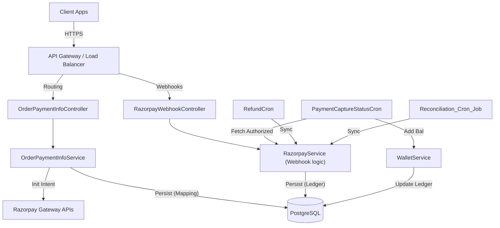
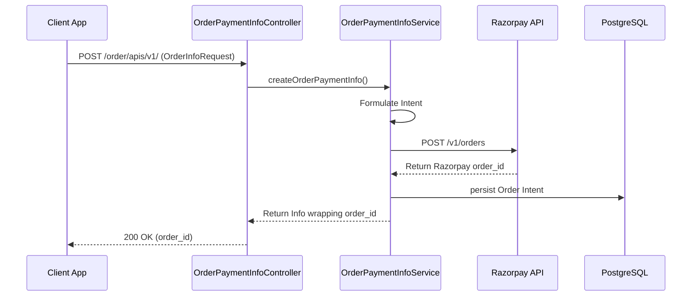
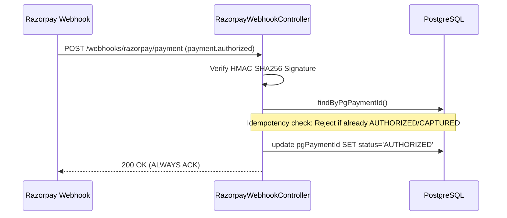
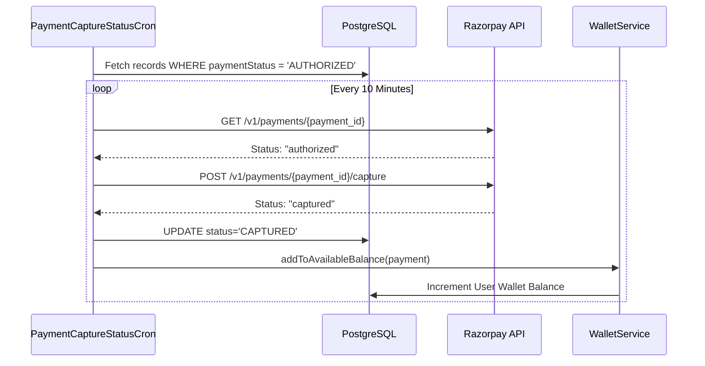

# Order Payment Info Service - Core Architecture & Workflows

**Project**: Order Payment Info Service
**Organization**: SARVM AI
**Stack**: Spring Boot, Java 11, PostgreSQL, Razorpay SDK

---

## 1. Executive Overview

The **Order Payment Info Service** is a dedicated ledger and orchestration microservice positioned alongside the generic Payment Service. While the generic payment service focuses on global stateless proxying, the `Order Payment Info Service` focuses deeply on mapping transactions to an internal `WalletService` (representing the `available_balance` of entities/users). 

It acts as the strict bookkeeper by creating Razorpay orders, securely validating HMAC signatures on Webhooks when funds are authorized, and employing precise cronjobs to manually "capture" funds on the gateway right before crediting the internal wallet.

## 2. System Architecture

The service runs on a standard Spring Boot Layered Architecture but places distinct emphasis on Scheduled tasks acting as the primary agents for balance reconciliation.

### Architecture Diagram



- **Routing / Presentation Layer**: REST Controllers like `OrderPaymentInfoController` and `RazorpayWebhookController`.
- **Service Layer**: Manages the local `WalletService`, internal Order mapping, and external `RazorpayService`.
- **Data Access Layer**: Repositories managed by Spring Data JPA interacting with PostgreSQL.
- **Background Actions**: Crucial @Scheduled cronjobs (`PaymentCaptureStatusCron`, `RefundCron`, `Reconciliation_Cron_Job`) dedicated to async ledger resolution.

## 3. Data Flow Workflows

### Workflow 1: PG Order Creation 

Standard order initiation ensuring SARVM controls the genesis block.



### Workflow 2: Webhooks (Authorization Phase)

Unlike auto-capture configurations, this service ingests `payment.authorized` events first without instantly capturing, preserving an idempotency check.



### Workflow 3: Cron Capture + Wallet Balance Allocation (Capture Phase)

This is the linchpin mechanism. Funds are only confirmed and routed to the User's Ledger (`available_balance`) once the background Cron securely executes the Capture.



## 4. Tech Stack

- **Platform**: OpenJDK 11
- **Framework**: Spring Boot 2.7.x
- **Persistence**: Spring Data JPA & Hibernate
- **Database**: PostgreSQL
- **Build Tool**: Maven
- **External SDK**: Razorpay Java Client (`com.razorpay`)

## 5. Project Structure

```text
src/main/java/com/sarvm/backendservice/orderpaymentinfo/
├── controller/        # Exposed REST HTTP Endpoints
├── service/           # Internal core logic (WalletService, OrderPaymentInfoService)
├── repository/        # PostgreSQL Interfaces
├── entity/            # Hibernate mapping classes (SarvmOrderInfoPgPayment, etc)
├── dto/               # Communication wrappers
├── crons/             # Scheduled Background synchronizations 
├── util/              # Parsers and Handlers
└── security/          # Auth Context configurations
```

## 6. Core Functionality

- **Transactional Intent Verification**: Creates explicit `pgOrders` natively wrapped with SARVM user identifiers to map transactions internally without trusting the client.
- **Idempotent Webhook Processing**: Catches `payment.authorized`, logs the status, and ignores duplicate network shouts.
- **Explicit Wallet Captures**: The gateway captures logic is detached from the user HTTP session and moved into a 10-minute trailing heartbeat node (`PaymentCaptureStatusCron`). 
- **Refund Orchestration**: Background syncing to assure users refunds are logged appropriately.

## 7. APIs & Integrations

**Exposed Endpoints**:
- `POST /order/apis/v1/` - Start checkout sequence.
- `PUT /order/apis/v1/` - Update states manually (if allowed).
- `POST /webhooks/razorpay/payment` - Endpoint receiving event payload from Razorpay backend explicitly.
- `GET /order/apis/v1/health` - Heartbeat probes.

**Internal Integrations**:
- Calls to `WalletService` methods locally rather than via REST, indicating tight coupling between Payments and Wallet ledgers.

## 8. Database Design

1. Primary Tables:
   - **Sarvm_Order_Info_Payment_Details** (or similar Entity name logging generic payments).
   - **SarvmOrderInfoPgPayment**.
2. **Wallet Records**: Ledgers logging `available_balance` and delta histories per transaction. 

## 9. Setup & Installation

Typical Spring Application.
1. Populate DB keys in environment:
   - `spring.datasource.url` 
   - `spring.datasource.username` / `spring.datasource.password`
   - `env.RAZORPAY_WEBHOOK_SECRET`
2. Start server locally:
   ```bash
   mvn clean install
   mvn spring-boot:run
   ```

## 10. User Flow

1. User finalizes the cart.
2. Frontend queries `OrderPaymentInfoService` for a new Gateway Order Intent.
3. User pays via UPI/Card in UI.
4. Razorpay sends the backend a web trigger proving funds are authorized.
5. Within 10 mins, the Cron grabs the authorized receipt, captures the liquidity dynamically on Razorpay's end, and adds the sum to the local Database Ledger (`available_balance`). The funds are now structurally confirmed inside the platform.

## 11. Edge Cases & Limitations

- **Failed Captures**: If `capturePayment()` throws an error in the Cron (due to gateway timeout or policy), the balance is inherently NOT updated. It will remain in an Authorized state to be resolved later or gracefully voided.
- **Wallet Latency**: Users will not see their `available_balance` update the exact millisecond they pay. Due to the Cron, it will occur asynchronously in near-real-time (T+10min max).

## 12. Performance & Scalability

- Single threaded crons handling batch operations sequentially. 
- During high loads (sales), the Webhook logic holds extremely little computational density (only an HMAC check and a quick DB insert), allowing massive concurrent intake. The heavy network polling is delegated to the cron.

## 13. Future Improvements

1. **Horizontal Scaling for Crons**: Implement ShedLock or internal DB distributed locks because if this service spawns >1 replicas, the `PaymentCaptureStatusCron` will execute redundantly causing dual-calls to the capture endpoint.
2. **Event Driven Wallet Processing**: Migrate the cron cycle to an explicit event pipeline framework (like Kafka) so `available_balance` registers immediately to enhance UI responsivity.

## 14. Summary

The `Order Payment Info Service` behaves as a secure ledger bridging actual financial transfers into the SARVM internal wallet mechanics cleanly. By segmenting authorization (webhooks) from the actual financial capture (cron execution), the service achieves fault-tolerant reliability crucial for handling digital currency.
