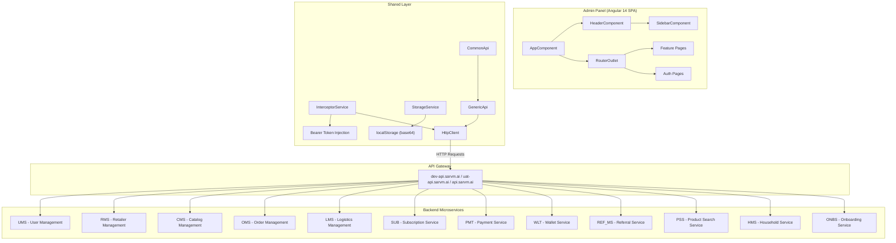
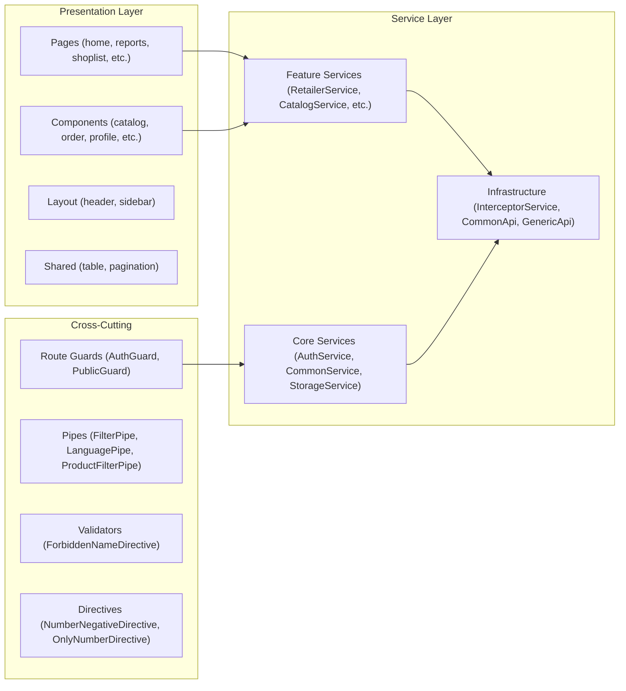
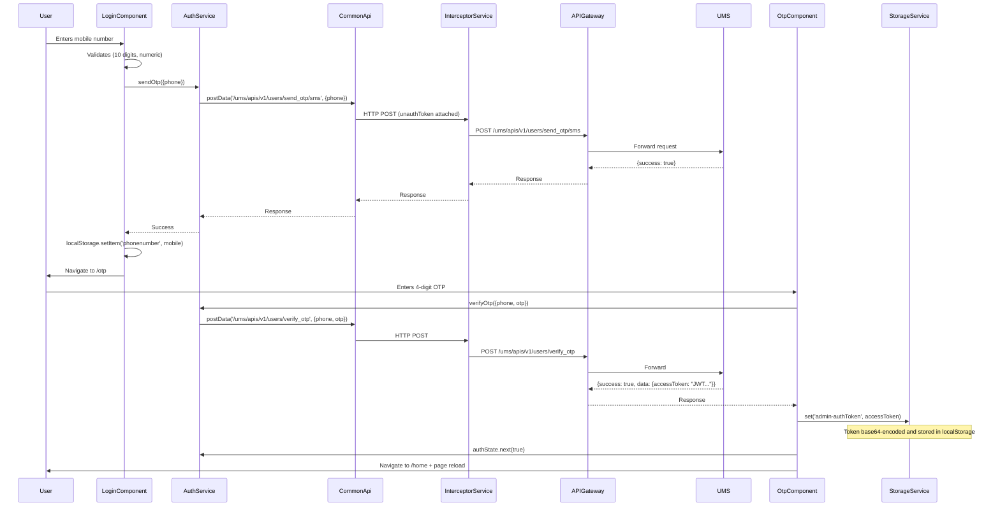
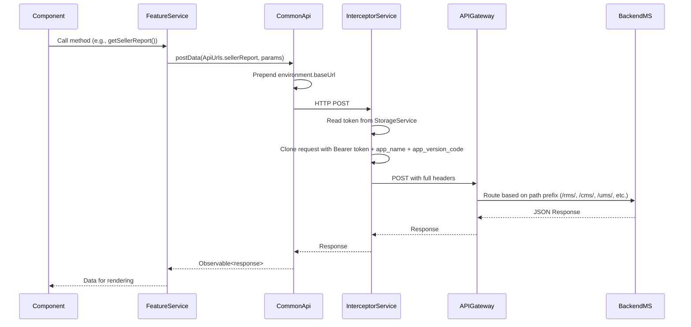
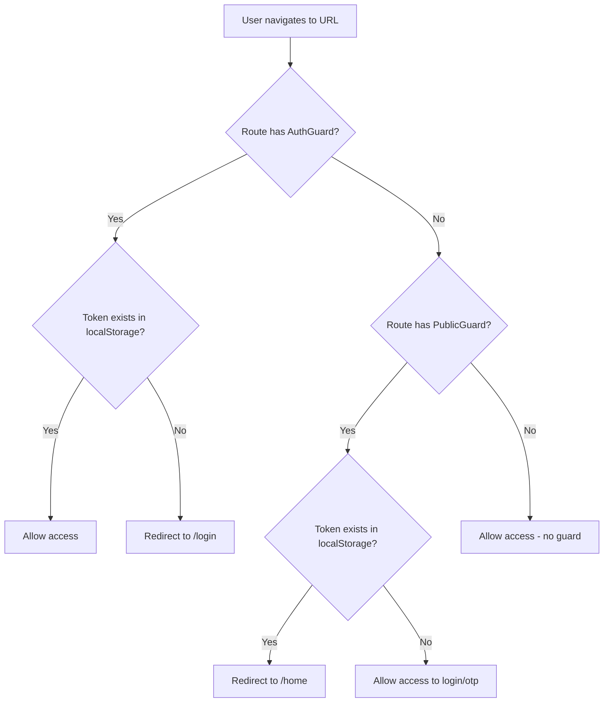
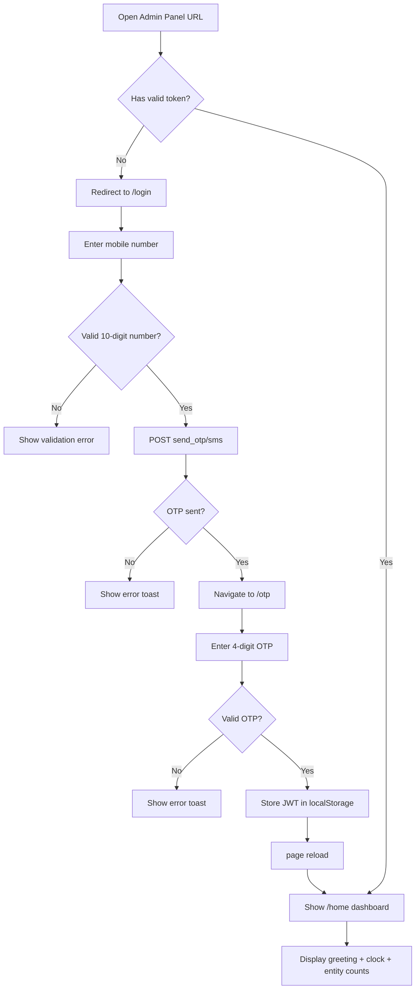
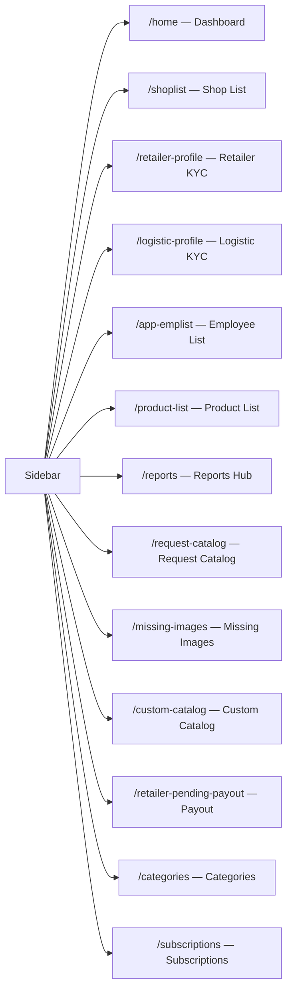
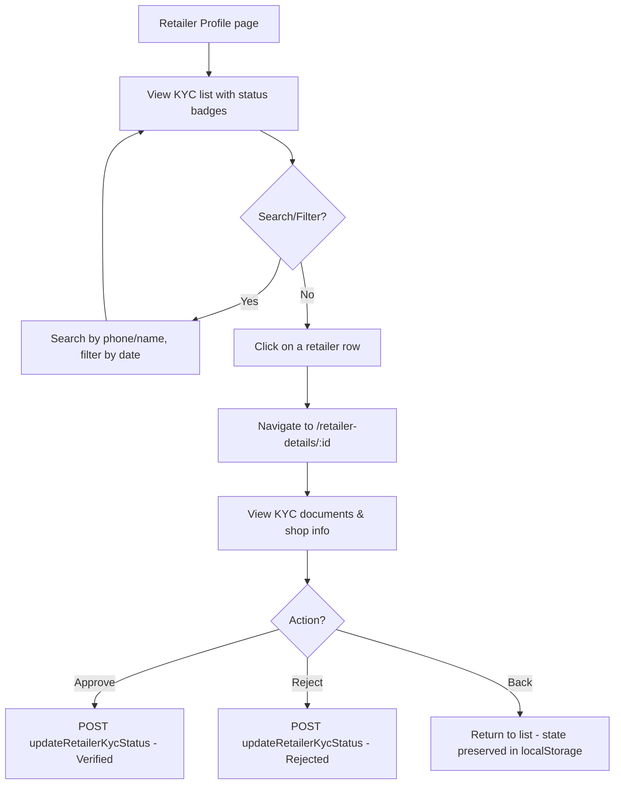
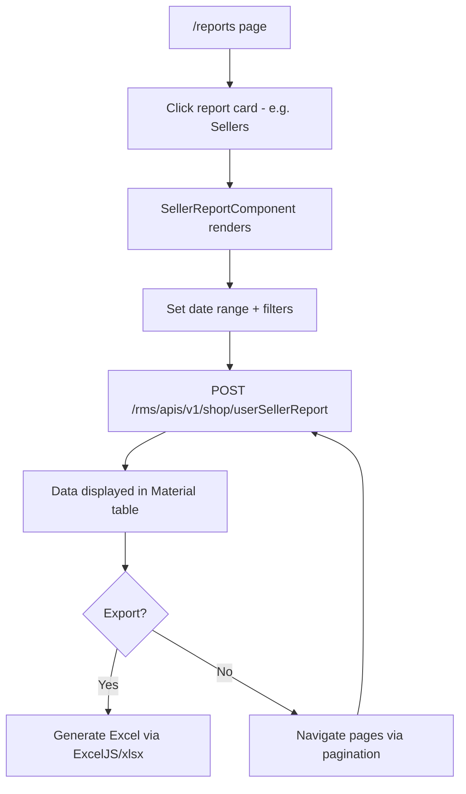

# SarvM Admin Panel — Architecture & Workflow Blueprint

---

## Table of Contents

1. [Executive Overview](#1-executive-overview)
2. [System Architecture](#2-system-architecture)
3. [Data Flow](#3-data-flow)
4. [Tech Stack](#4-tech-stack)
5. [Project Structure](#5-project-structure)
6. [Core Functionality](#6-core-functionality)
7. [APIs & Integrations](#7-apis--integrations)
8. [Database Design](#8-database-design)
9. [Setup & Installation](#9-setup--installation)
10. [User Flow](#10-user-flow)
11. [Edge Cases & Limitations](#11-edge-cases--limitations)
12. [Performance & Scalability](#12-performance--scalability)
13. [Future Improvements](#13-future-improvements)
14. [Summary](#14-summary)

---

## 1. Executive Overview

### What is the Admin Panel?
The **SarvM Admin Panel** is an internal, web-based management dashboard built for administrative users of the SarvM marketplace platform. It provides a centralised interface for managing **shops, retailers, employees, products/catalogs, orders, KYC verification, subscriptions, logistics, and reporting** across the entire SarvM ecosystem.

### Why does it exist?
- **Centralised Operations**: Enables the operations team to manage the entire SarvM B2B/B2C marketplace from one place—reviewing KYC documents, toggling shop statuses, managing product catalogs, viewing order reports, and processing retailer payouts.
- **Data Visibility**: Provides real-time dashboards and downloadable reports across all platform entities (users, sellers, orders, subscriptions, logistics, referrals, tickets, rewards, deleted accounts, wallet payouts).
- **Content Moderation**: Allows admins to approve/reject retailer product requests, custom catalog requests, and missing product images before they go live on the consumer-facing apps.

### Who uses it?
Internal SarvM staff—operations managers, support agents, and administrators who require elevated privileges over the platform data.

### Key Design Decisions
| Decision | Rationale |
|---|---|
| **Angular 14 (not latest)** | Aligns with the existing Ionic 6 toolkit used across SarvM's mobile apps, enabling shared knowledge. |
| **Flat routing (no lazy-loading)** | All routes eagerly loaded. Trade-off: faster initial dev speed over bundle optimisation. |
| **`localStorage` for state** | Token and service state persisted in `localStorage` using base64 encoding—avoids server-side session management for a purely internal tool. |
| **Single gateway API** | All API calls route through one `baseUrl` (e.g., `https://dev-api.sarvm.ai`) which acts as an API gateway, proxying to backend microservices (`ums`, `rms`, `cms`, `oms`, `lms`, `sub`, `pmt`, `wlt`, `ref_ms`, `pss`, `hms`, `onbs`). |

---

## 2. System Architecture

### High-Level Architecture Diagram



### Component Layering



### Why this architecture?
- **Separation of Concerns**: Presentation (templates + components), Service (business logic + API calls), and Infrastructure (HTTP, guards, interceptors) are clearly layered.
- **Single HTTP Choke-Point**: All HTTP calls flow through `GenericApi → CommonApi → InterceptorService`, making it trivial to add global auth headers, error handling, and loading spinners.
- **Guard-Protected Routes**: `AuthGuard` and `PublicGuard` ensure unauthenticated users can only access `/login` and `/otp`, while authenticated users skip the login screen.

---

## 3. Data Flow

### 3.1 Authentication Flow



#### Why this flow?
- **OTP-based auth**: No passwords; only phone + OTP. Suited for internal admin users with verified mobile numbers.
- **unauthToken**: A pre-configured anonymous JWT is used for endpoints that need a token but the user hasn't logged in yet (e.g., the OTP endpoints themselves).
- **Page reload**: After login, `window.location.reload()` is called to re-initialise all services (especially `CommonService.setUserData()` and `HeaderComponent.showMenu`).

### 3.2 Typical Protected API Call Flow



#### Why this design?
- **DRY principle**: The interceptor handles token injection for every outgoing request centrally. Individual services never deal with auth headers.
- **Skip header**: For external calls (e.g., uploading to pre-signed S3 URLs, CDN links), a `skip: 'true'` header is set, and the interceptor strips it instead of injecting the Bearer token.

### 3.3 Route Guard Flow



---

## 4. Tech Stack

### Core Framework & Libraries

| Technology | Version | Purpose | Why Chosen |
|---|---|---|---|
| **Angular** | 14.x | Application framework | Aligns with existing SarvM Ionic mobile apps; strong TypeScript support; mature ecosystem for enterprise apps. |
| **TypeScript** | ~4.7.2 | Type-safe JavaScript | Compile-time type checking reduces runtime errors in a large admin tool. |
| **RxJS** | ~7.5.0 | Reactive programming | Angular's native async paradigm for HTTP calls, state management via `BehaviorSubject`. |
| **Angular Material** | ^14.2.7 | UI component library | Pre-built Material Design components (tables, cards, dialogs, date pickers, tooltips, spinners, etc.). |
| **Bootstrap** | ^5.2.2 | CSS framework | Grid system, utility classes, responsive design. Used alongside Angular Material. |
| **Ionic Angular** | ^6.4.1 | Cross-platform UI components | Provides icons (`ion-icon`) and some UI primitives shared with mobile apps. |

### Data & Reporting

| Technology | Version | Purpose |
|---|---|---|
| **DataTables + jQuery** | ^1.13.2 / ^3.6.3 | Server-side-like paginated tables in some views. |
| **angular-datatables** | ^13.0.0 | Angular wrapper for jQuery DataTables. |
| **Chart.js** | ^4.4.4 | Data visualization (available but not heavily used currently). |
| **ExcelJS** | ^4.4.0 | Client-side Excel file generation for report downloads. |
| **xlsx** | ^0.18.5 | Spreadsheet parsing/generation for bulk upload/download features. |
| **Moment.js** | ^2.30.1 | Date formatting and manipulation across reports. |

### UX & Feedback

| Technology | Version | Purpose |
|---|---|---|
| **ngx-toastr** | ^15.2.2 | Toast notifications for success/error/warning messages across the app. |
| **SweetAlert2** | ^11.4.8 | Rich modal dialogs for confirmations, alerts, and user prompts. |
| **ngx-ui-loader** | ^13.0.0 | Global loading spinner that auto-triggers on HTTP calls via `NgxUiLoaderHttpModule`. |
| **ngx-pagination** | ^6.0.3 | Client-side pagination for paginated lists. |
| **ng-otp-input** | ^1.8.5 | OTP input component (available, though custom OTP inputs are also used). |

### Auth & Security

| Technology | Version | Purpose |
|---|---|---|
| **@auth0/angular-jwt** | ^5.1.1 | JWT decoding utilities (available in deps, though `CommonService.parseJwt()` handles decoding manually). |

### Maps

| Technology | Source | Purpose |
|---|---|---|
| **Leaflet** | CDN v1.9.3 | Interactive maps for shop location viewing/editing. Loaded via `index.html` CDN links. |

### Build & CI/CD

| Technology | Details |
|---|---|
| **Angular CLI** | ~14.0.2 — Build, serve, test orchestration. |
| **Karma + Jasmine** | Unit testing framework (configured but lightly used). |
| **AWS CodeBuild** | `buildspec.yml` defines CI/CD pipeline: installs Node 16.x, runs `ng build -c=${CURRENT_ENVIRONMENT}`, outputs `dist/admin-panel/`. |

### Environment-Specific Configuration

| Environment | `baseUrl` | `environmentKey` | Build Flag |
|---|---|---|---|
| **Development** | `https://dev-api.sarvm.ai` | `dev` | `ng build` (default) |
| **UAT** | `https://uat-api.sarvm.ai` | `uat` | `ng build -c=uat` |
| **Production** | `https://api.sarvm.ai` | `prod` | `ng build -c=production` |

All environments share the same `unauthToken` (anonymous JWT token) and `app_name: 'admin'` / `app_version_code: '101'`.

---

## 5. Project Structure

```
frontend/admin_panel/
├── angular.json                    # Angular workspace config (build configs, styles, scripts)
├── buildspec.yml                   # AWS CodeBuild CI/CD pipeline definition
├── package.json                    # NPM dependencies & scripts
├── tsconfig.json                   # Root TypeScript config
├── tsconfig.app.json               # App-specific TS config
├── tsconfig.spec.json              # Test-specific TS config
├── karma.conf.js                   # Karma test runner config
│
├── src/
│   ├── index.html                  # SPA entry point (Leaflet CDN, DataTables CDN, FontAwesome)
│   ├── main.ts                     # Angular bootstrap entry (platformBrowserDynamic)
│   ├── polyfills.ts                # Browser polyfills
│   ├── styles.css                  # Global CSS (Material theme, body styles, layout utilities)
│   ├── favicon.ico                 # App icon
│   ├── test.ts                     # Karma test bootstrap
│   │
│   ├── environments/
│   │   ├── environment.ts          # Dev config (baseUrl, unauthToken, app_name)
│   │   ├── environment.prod.ts     # Production config
│   │   └── environment.uat.ts      # UAT config
│   │
│   ├── theme/
│   │   └── global.scss             # Global SCSS theme variables
│   │
│   ├── assets/                     # Static assets (images, SVGs, icons)
│   │
│   └── app/
│       ├── app.module.ts           # Root NgModule (all declarations, imports, providers)
│       ├── app-routing.module.ts   # All route definitions (flat, no lazy-loading)
│       ├── app.component.ts/html   # Root component (<app-header> + <router-outlet> + <ngx-ui-loader>)
│       │
│       ├── config/
│       │   └── constants.ts        # API URL registry, localStorage keys, order statuses, validators
│       │
│       ├── auth/                   # Authentication components
│       │   ├── login/              #   Login page (phone number entry → send OTP)
│       │   └── otp/                #   OTP verification page (4-digit OTP → JWT storage)
│       │
│       ├── layout/                 # Persistent layout components
│       │   ├── header/             #   Top navbar (logo, settings dropdown, logout, offcanvas)
│       │   └── sidebar/            #   Left sidebar (navigation menu with 12 items)
│       │
│       ├── lib/                    # Core library layer
│       │   ├── guard/
│       │   │   ├── auth.guard.ts   #   Blocks unauthenticated access → redirects to /login
│       │   │   └── public.guard.ts #   Blocks authenticated users from login → redirects to /home
│       │   │
│       │   ├── pipe/
│       │   │   ├── filter.pipe.ts  #   Generic object search filter for lists
│       │   │   ├── language.pipe.ts#   Language display pipe
│       │   │   └── product-filter.pipe.ts # Product-specific filter
│       │   │
│       │   ├── utils/
│       │   │   └── data.utils.ts   #   Date formatting (Moment.js), empty checks
│       │   │
│       │   └── services/
│       │       ├── api/
│       │       │   ├── shared/
│       │       │   │   └── generic.api.ts   # Base HTTP methods (get, post, put, delete)
│       │       │   └── common.api.ts        # App-specific API methods extending GenericApi
│       │       │
│       │       ├── interceptor.service.ts   # HTTP interceptor (Bearer token, app_name, app_version_code)
│       │       ├── storage.service.ts       # localStorage wrapper (base64 encode/decode)
│       │       ├── auth.service.ts          # Auth state management (BehaviorSubject), OTP APIs
│       │       ├── common.service.ts        # JWT parsing, toastr wrappers, user state
│       │       │
│       │       ├── retailer.service.ts      # Retailer KYC list, details, status updates
│       │       ├── catalog.service.ts       # Product/category/catalog CRUD, sync, bulk upload
│       │       ├── shop-data.service.ts     # Shop CRUD, reverse geocoding
│       │       ├── shopaddress.service.ts   # Shop listing, search, bulk update, status change
│       │       ├── order.service.ts         # Order fetching (active, history)
│       │       ├── employee.service.ts      # Employee details
│       │       ├── totalentity.service.ts   # Dashboard total counts (shops, retailers, employees)
│       │       ├── missing-img.service.ts   # Missing image list, status update, upload
│       │       ├── custom-catalog.service.ts# Custom catalog requests
│       │       ├── onboard.service.ts       # Onboarding KYC detail fetch, product creation
│       │       ├── kycdetail.service.ts     # KYC details endpoint
│       │       ├── logistic-kyc.service.ts  # Logistic KYC list, status update
│       │       │
│       │       ├── order-report.service.ts          # Order report generation
│       │       ├── sellerreport.service.ts          # Seller report, shop status change
│       │       ├── subscription-report.service.ts   # Subscription report generation
│       │       ├── subscription-management.service.ts # Subscription management (list/detail)
│       │       ├── catalog-report.service.ts        # Catalog report generation
│       │       ├── logistic-report.service.ts       # Logistic report generation
│       │       ├── referral-report.service.ts       # Referral report generation
│       │       ├── user-all.service.ts              # All users report
│       │       ├── ticketreport.service.ts          # Ticket report generation
│       │       ├── reward-report.service.ts         # Reward report generation
│       │       ├── deleted-account-report.service.ts# Deleted account report
│       │       │
│       │       ├── retailer-requested-product/
│       │       │   └── retailer-requested-product.service.ts  # Retailer product requests CRUD
│       │       ├── add-update-product/
│       │       │   └── add-update-product.service.ts          # Product add/update & request reject
│       │       └── userCustomer/
│       │           └── user-customer.service.ts               # User customer report
│       │
│       ├── component/              # Feature-specific components
│       │   ├── catalog/
│       │   │   ├── catalog/        #   Catalog list + form (CRUD)
│       │   │   ├── category/       #   Category list + form (CRUD) with routing module
│       │   │   └── product/        #   Product form + list + bulk upload
│       │   ├── order/              #   Active orders, order history, track order, shop orders (with own module)
│       │   ├── profile/            #   Retailer profile list + retailer details
│       │   ├── retailer-payment-details/  #  Retailer payment status
│       │   ├── shop-details/       #   Shop details view
│       │   └── shopData/           #   Shop data CRUD (edit shop, view shop)
│       │
│       ├── pages/                  # Full page-level components
│       │   ├── home/               #   Dashboard (total shops, retailers, employees)
│       │   ├── emplist/            #   Employee list with search + pagination
│       │   ├── shop-address-page/  #   Shop list with search, pagination, bulk update
│       │   ├── retail-kyc-detail/  #   Retailer KYC review detail page
│       │   ├── logistic-kyc-list/  #   Logistic KYC list + detail page
│       │   ├── reports/            #   Reports hub (12 report sub-components)
│       │   ├── request-catalog/    #   Retailer product requests + detail + update
│       │   ├── custom-catalog/     #   Custom catalog requests + detail page
│       │   ├── missing-image/      #   Missing product images management
│       │   ├── categories/         #   S3-sourced category tree viewer
│       │   ├── subscriptions/      #   Subscription list + detail
│       │   └── tree/               #   Category data tree visualization
│       │
│       ├── shared/                 # Shared/reusable components & directives
│       │   ├── table/              #   Generic table component with actions (delete, update, status)
│       │   ├── pagination/         #   Reusable pagination component
│       │   ├── empservice.service.ts      # Shared employee service
│       │   ├── number-negative.directive.ts  # Restricts negative number input
│       │   └── onlynumber.directive.ts       # Restricts input to numbers only
│       │
│       └── validator/
│           └── forbidden-name.directive.ts  # Custom form validator
```

---

## 6. Core Functionality

### 6.1 Authentication & Session Management

**What**: Phone-based OTP authentication with JWT token storage.

**How it works**:
1. **Login Page** (`/login`): Admin enters a 10-digit Indian mobile number. Form validation enforces numeric-only, 10-digit minimum via `Validators`.
2. **OTP Delivery**: `AuthService.sendOtp()` calls `POST /ums/apis/v1/users/send_otp/sms`. Supports SMS and voice call OTP resend via `resendOtp()`.
3. **OTP Verification** (`/otp`): Admin enters a 4-digit OTP across four input fields. Supports paste-to-fill. `AuthService.verifyOtp()` calls `POST /ums/apis/v1/users/verify_otp`.
4. **Token Storage**: On success, `response.data.accessToken` (JWT) is stored in `localStorage` key `admin-authToken` via `StorageService.set()`. The value is `btoa(escape(JSON.stringify(token)))` encoded.
5. **Session Bootstrapping**: After token storage, `AuthService.authState` (`BehaviorSubject<boolean>`) is set to `true`, and the page reloads to re-initialise `CommonService.setUserData()` which decodes the JWT to extract user info (e.g., `phone`).
6. **Logout**: Clears all `localStorage` and navigates to `/login`.

**Why OTP?**: SarvM standardises on phone-based OTP across all apps (consumer, retailer, delivery, admin). No separate password system reduces attack surface.

**API calls**:
- `POST /ums/apis/v1/users/send_otp/sms` — Send OTP via SMS
- `POST /ums/apis/v1/users/send_otp/call` — Resend OTP via voice call
- `POST /ums/apis/v1/users/verify_otp` — Verify OTP, returns JWT

---

### 6.2 Dashboard (Home Page)

**What**: Landing page after login showing a real-time clock and aggregate platform statistics.

**How it works**:
1. `HomeComponent.ngOnInit()` calls `TotalentityService.getTotalentity()`.
2. This hits `GET /ums/apis/v1/employee/getTotalEntity` → returns `{ shops, retialers, employees }`.
3. Three Material cards display these counts.
4. A greeting message (Good Morning/Afternoon/Evening/Night) is computed from the current hour.
5. A real-time clock updates every second using RxJS `timer(0, 1000).pipe(map(() => new Date()))`.

**API call**: `GET /ums/apis/v1/employee/getTotalEntity`

---

### 6.3 Shop Management

**What**: Full lifecycle management of retail shops on the platform.

**Sub-features**:

| Feature | Route | Component | API Endpoint | Service |
|---|---|---|---|---|
| Shop List | `/shoplist` | `ShopAddressPageComponent` | `GET /rms/apis/v1/shop?limit=&offset=` | `ShopaddressService.getShops()` |
| Shop Search | `/shoplist` | `ShopAddressPageComponent` | `GET /rms/apis/v1/shop/searchShopByShopIdOrName?shopId=&shopName=&phoneNumber=` | `ShopaddressService.searchShop()` |
| View Shop | `/view-shop-details/:id` | `ViewShopComponent` | `GET /rms/apis/v2/shop/:id` | `ShopDataService.callShopDataApi()` |
| Edit Shop | `/edit-shop-data/:id` | `EditShopComponent` | `PUT /rms/apis/v1/shop/:id` | `ShopDataService.updateShopDataApi()` |
| Shop Details | `/shopDetails/:_id` | `ShopDetailsComponent` | `GET /rms/apis/v1/shop/retailerAndShop/:id` | `RetailerService.getRetailerDetailsById()` |
| Shop Status Toggle | `/shoplist` | `TableComponent` | `PUT /rms/apis/v1/shop/shopStatus/:userId` | `ShopaddressService.updateBusinessStatus()` |
| Bulk Product Update | `/bulk-update/:id` | `BulkUpdateComponent` | `PUT /cms/apis/v1/bulkupdate/retailerProducts/:id` | `ShopaddressService.bulkUpdate()` |
| Shop Products Download | `/shoplist` | `ShopAddressPageComponent` | `GET /cms/apis/v1/retailercatalog/getRetailerProductsDownload/:id` | `ShopaddressService.getDataByShop()` |
| Reverse Geocoding | Edit Shop | `EditShopComponent` | `GET https://nominatim.openstreetmap.org/reverse.php?lat=&lon=&zoom=18&format=jsonv2` | `ShopDataService.getAddressFormLatlong()` |

**Why Leaflet?**: The edit shop page uses Leaflet maps for visual shop location editing. The admin can drag a marker to set GPS coordinates, then reverse-geocode via OpenStreetMap Nominatim to auto-fill the address.

---

### 6.4 Retailer & Logistic KYC Management

**What**: Review, approve, or reject KYC documents submitted by retailers and delivery boys.

**How it works**:
1. **Retailer KYC List** (`/retailer-profile`): `RetailerService.getRetailerKYCDetailsList()` calls `POST /ums/apis/v1/users/retailerKycData` with pagination, search, and date filters.
2. **KYC Status Normalisation**: `normalizeKycStatus()` maps raw statuses to canonical values: `Uploaded`, `InProgress`, `Verified`, `Pending`, `Rejected`.
3. **State Persistence**: `RetailerService` / `LogisticKycService` persist their paginated state (page, pageSize, list data, total count) to `localStorage` so the admin can navigate to a detail page and return without losing their place.
4. **Detail View** (`/retailer-details/:id`): Shows full retailer profile, KYC docs, shop info.
5. **Status Update**: `RetailerService.updateRetailerKYCStatus()` calls `POST /onbs/apis/v1/onboarding/retailer/updateRetailerKycStatus`.
6. **Logistic KYC** follows the identical pattern: `POST /ums/apis/v1/users/logisticKycData` for list, `POST /onbs/apis/v1/onboarding/logistic/updateLogisticKycStatus` for status update.

**API Calls**:
| Action | Endpoint | Method |
|---|---|---|
| List retailer KYC | `/ums/apis/v1/users/retailerKycData` | POST |
| Update retailer KYC status | `/onbs/apis/v1/onboarding/retailer/updateRetailerKycStatus` | POST |
| List logistic KYC | `/ums/apis/v1/users/logisticKycData` | POST |
| Update logistic KYC status | `/onbs/apis/v1/onboarding/logistic/updateLogisticKycStatus` | POST |
| Get KYC details by userId | `/onbs/apis/v1/onboarding/retailer/kyc/kycDetails/:id` | GET |

---

### 6.5 Product & Catalog Management

**What**: Full CRUD operations on the master product catalog, categories, and catalogs.

**Sub-features**:

| Feature | Route | API Endpoint | Service Method |
|---|---|---|---|
| Product List | `/product-list` | `GET /cms/apis/v1/product?q=&page=&pageSize=&categoryId=` | `CatalogService.getProducts()` |
| Product Search (PSS) | `/product-list` | `GET /pss/apis/v1/adminProductSearch?product=&page=&pageSize=` | `CatalogService.searchProducts()` |
| Product Create | `/product-form/:id` | `POST /cms/apis/v1/product` | `CatalogService.addProduct()` |
| Product Update | `/product-form/:id` | `PUT /cms/apis/v1/product/:id` | `CatalogService.updateProductById()` |
| Product Delete | `/product-list` | `DELETE /cms/apis/v1/product/:id` | `CatalogService.deletProduct()` |
| Product Image Upload | `/product-form/:id` | `GET /cms/apis/v1/product/image` (pre-signed URL) → `PUT <S3 URL>` | `CatalogService.getPresignedUrl()` + `CatalogService.upload()` |
| Product Mapping | `/product-form/:id` | `PUT /cms/apis/v1/product/:id/mapping` | `CatalogService.addproductMapping()` |
| Catalog Tree | `/product-form/:id` | `GET /cms/apis/v1/metadata/mastercatalog` | `CatalogService.getcatalogTreedata()` |
| Product Sync | `/product-list` | `GET /cms/apis/v1/product/sync` | `CatalogService.syncOperation()` |
| Bulk Upload | `/bulk-upload` | `POST /cms/apis/v1/bulkupdate` | `CatalogService.bulkUpload()` |
| Category CRUD | `/category-list`, `/category-form/:id` | `GET/POST/PUT/DELETE /cms/apis/v1/category` | `CatalogService.getCategory()`, etc. |
| Catalog CRUD | `/catalog-list`, `/catalog-form/:id` | `GET/POST/PUT/DELETE /cms/apis/v1/catalog` | `CatalogService.getCatalogData()`, etc. |
| Categories (S3) | `/categories` | `GET https://s3.../categoriesList/{env}.json` | `CatalogService.fetchCategories()` |
| Data Tree | (internal) | `GET /cms/apis/v1/dataTree` | `CatalogService.onGetDataTree()` |

**Image Upload Flow**:
1. Client requests a pre-signed S3 URL: `GET /cms/apis/v1/product/image` → returns `{ url: "https://s3...?Signature=..." }`
2. Client uploads the file directly to S3: `PUT <pre-signed URL>` with `FormData` (bypasses interceptor via `skip` header).
3. The S3 key path is stored in the product record.

---

### 6.6 Request Catalog & Custom Catalog

**What**: Manages product requests from retailers ("I want to sell product X") and custom catalog field requests.

| Feature | Route | API | Service |
|---|---|---|---|
| Request Catalog List | `/request-catalog` | `GET /cms/apis/v1/newProductReq?page=&limit=` | `RetailerRequestedProductService.getProduct()` |
| Request Detail | `/product-detail/:id` | `GET /cms/apis/v1/newProductReq/:id` | `RetailerRequestedProductService.getProductById()` |
| Update Request | `/update-product/:id` | `PUT /cms/apis/v1/newProductReq/:id` | `RetailerRequestedProductService.updateProduct()` |
| Add/Update from Request | `/update-product/:id` | `PUT /cms/apis/v1/retailercatalog/updateProducts` | `AddUpdateProductService.updateProduct()` |
| Reject Request | `/update-product/:id` | `PUT /cms/apis/v1/newProductReq/updateProductRequestStatus` | `AddUpdateProductService.rejectRequest()` |
| Custom Catalog List | `/custom-catalog` | `GET /cms/apis/v1/customCatalog?page=&limit=` | `CustomCatalogService.getCustomRequests()` |
| Custom Catalog Update | `/custom-catalog-detail/:id` | `PUT /cms/apis/v1/customCatalog/updateCustomFieldsStatus/:shopId` | `CustomCatalogService.updateRequest()` |

---

### 6.7 Missing Images

**What**: Product images flagged as missing by the system. Admins can review, update status, or upload replacement images.

| Action | API | Service Method |
|---|---|---|
| List missing images | `GET /cms/apis/v1/product/missingImagesList?page=&pageSize=&q=` | `MissingImgService.getMissingImage()` |
| Update image status | `POST /cms/apis/v1/product/missingImageStatusUpdate` | `MissingImgService.updateImageStatus()` |
| Upload replacement image | `POST /cms/apis/v1/retailercatalog/uploadMissingImage` (FormData) | `MissingImgService.uploadMissingImage()` |

---

### 6.8 Order Management

**What**: View and track orders across the platform.

| Feature | Route | API | Service |
|---|---|---|---|
| Active Orders | `/active-orders` | `GET /hms/apis/v1/orders/` | `OrderService.getOrders()` |
| Order History | `/order-history` | `GET /rms/apis/v1/orders?status=ALL` | `OrderService.getOrderHistory()` |
| Track Order | `/track-order/:id` | (Component-level) | (Component-level) |
| Shop Orders | `/shop-orders/:id` | `GET /rms/apis/v1/orders/:id` | (Component-level) |

**Order Statuses** (defined in `Constants.ORDER_STATUS`):
- `1`: NEW → `2`: ACCEPTED → `3`: PROCESSING → `4`: READY → `5`: DISPATCH → `6`: DELIVERED
- `7`: CANCELLED, `8`: REJECTED

---

### 6.9 Employee Management

**What**: View the list of all SarvM employees with search and pagination.

| Action | API | Service |
|---|---|---|
| Employee list | `GET /ums/apis/v1/employee/allEmp?q=&page=&pageSize=` | `CatalogService.getemployeeDetails()` |
| Employee detail | `GET /ums/apis/v1/employee/allEmp/:id` | `EmployeeService.getEmployee()` |

---

### 6.10 Subscription Management

**What**: View and manage retailer subscriptions on the platform.

| Feature | Route | API | Service |
|---|---|---|---|
| Subscription List | `/subscriptions` | `GET /sub/apis/v1/subscription/payment/history/all?phone=&userType=&page=&size=` | `SubscriptionManagementService.getUsersSubscriptionList()` |
| Subscription Detail | `/subscriptions-detail/:id` | `GET /sub/apis/v1/subscription/payment/history/:id` | `SubscriptionManagementService.getUserSubscriptionDetails()` |
| Create Subscription | (internal) | `POST /sub/apis/v1/subscription/initiate` | `CommonApi.createSubscription()` |
| Confirm Subscription | (internal) | `POST /sub/apis/v1/subscription/activate` | `CommonApi.confirmSubscription()` |

---

### 6.11 Reporting Hub

**What**: A single `/reports` page that acts as a hub, rendering one of 13 report sub-components based on which card the admin clicks.

**Architecture**: `ReportsComponent` uses `activeComponent` string state + `*ngIf` directives to dynamically show/hide report sub-components. The `/retailer-pending-payout` route reuses `ReportsComponent` with route data `{ activate: 'retailer-pending-payout', hideReportTiles: true }`.

| Report | Sub-Component | API Endpoint | Service |
|---|---|---|---|
| **Users** | `UserAllComponent` | `POST /ums/apis/v1/users/getUsersDataCsv` | `UserAllService.getUserAll()` |
| **Sellers** | `SellerReportComponent` | `POST /rms/apis/v1/shop/userSellerReport` | `SellerreportService.getSellerReport()` |
| **Orders** | `OrderReportComponent` | `POST /oms/apis/v1/orders/orderReport` | `OrderReportService.getOrderReport()` |
| **Subscriptions** | `SubscriptionReportComponent` | `POST /rms/apis/v1/shop/subscriptionReport` | `SubscriptionReportService.getSubscriptionReport()` |
| **Logistic** | `LogisticComponent` | `POST /lms/apis/v1/deliveryBoy/getDeliveryBoysCsv` | `LogisticReportService.getLogistic()` |
| **Catalog** | `CatalogReportComponent` | `POST /cms/apis/v1/retailercatalog/getCatalogueReport` | `CatalogReportService.getCatalog()` |
| **Referral** | `ReferralReportComponent` | `POST /ref_ms/apis/v1/report/getCleanReferralCsv` | `ReferralReportService.getReferral()` |
| **User Customer** | `UserCustomerComponent` | `POST /ums/apis/v1/users/getUserCustomerDataCsv` | `UserCustomerService.getUserCustomer()` |
| **Ticket** | `TicketReportComponent` | `POST /ums/apis/v1/Tickets/ticketsReport` | `TicketReportService.getTicketReport()` |
| **Reward** | `RewardReportComponent` | `POST /ref_ms/apis/v1/report/rewardReport` | `RewardReportService.getRewardReport()` |
| **Deleted Account** | `DeletedAccountReportComponent` | `POST /ums/apis/v1/users/deletedAccountReport` | `DeletedAccountReportService.getDeletedAccountReport()` |
| **Withdrawal Data** | `WithdrawalRequestComponent` | (Wallet APIs) | (Wallet service calls) |
| **Retailer Pending Payout** | `RetailerPendingPayoutComponent` | `GET /wlt/api/reconcile/retailer-pending-payouts` | (Wallet service) |

All reports support:
- **Date range filtering** (`startDate`, `endDate`)
- **Pagination** (`page`, `pageSize`)
- **Text search filter** (`filter`)
- **Language filter** (`selectedLanguage`) — where applicable

---

### 6.12 Wallet & Payout Management

**What**: Manages retailer payouts and settlement processing.

| Action | API | Method |
|---|---|---|
| Pending Payouts | `GET /wlt/api/reconcile/retailer-pending-payouts` | GET |
| Process Settlement | `PUT /wlt/api/settlements/:retailerId/:safeUtr?adminUser=:adminUser` | PUT |
| Settlement History | `GET /wlt/api/settlements/history` | GET |

---

### 6.13 Retailer Payment Details

**What**: View payment status for a specific retailer.

| Action | API | Service |
|---|---|---|
| Payment Status | `GET /pmt/apis/v1/razorpay/payment/getPaymentStatus/:id` | `RetailerService.getRetailerPaymentDetails()` |

---

## 7. APIs & Integrations

### 7.1 Complete API Endpoint Registry

All endpoints are relative to `environment.baseUrl` unless otherwise noted.

#### UMS — User Management Service (`/ums/`)

| Endpoint | Method | Purpose | Called By |
|---|---|---|---|
| `/ums/apis/v1/users/send_otp/sms` | POST | Send OTP via SMS | `AuthService.sendOtp()` |
| `/ums/apis/v1/users/send_otp/call` | POST | Resend OTP via voice call | `AuthService.resendOtp()` |
| `/ums/apis/v1/users/verify_otp` | POST | Verify OTP, returns JWT | `AuthService.verifyOtp()` |
| `/ums/apis/v1/users` | GET | Get users list | `UserService` |
| `/ums/apis/v1/users?type=retailer` | GET | Get retailer users | `RetailerService.getRetailerDetails()` |
| `/ums/apis/v1/users?userIds=:id` | GET | Get retailer profile by ID | `CommonApi.getRetailerProfileDetails()` |
| `/ums/apis/v1/users/getUsersDataCsv` | POST | All users report | `UserAllService.getUserAll()` |
| `/ums/apis/v1/users/getUserCustomerDataCsv` | POST | User customer report | `UserCustomerService.getUserCustomer()` |
| `/ums/apis/v1/users/retailerKycData` | POST | Retailer KYC data list | `RetailerService.getRetailerKYCDetailsList()` |
| `/ums/apis/v1/users/logisticKycData` | POST | Logistic KYC data list | `LogisticKycService.getLogisticKYCDetailsList()` |
| `/ums/apis/v1/users/deletedAccountReport` | POST | Deleted account report | `DeletedAccountReportService` |
| `/ums/apis/v1/employee/allEmp` | GET | Employee list | `CatalogService.getemployeeDetails()` |
| `/ums/apis/v1/employee/allEmp/:id` | GET | Employee detail | `EmployeeService.getEmployee()` |
| `/ums/apis/v1/employee/getTotalEntity` | GET | Dashboard totals | `TotalentityService.getTotalentity()` |
| `/ums/apis/v1/Tickets/ticketsReport` | POST | Ticket report | `TicketReportService.getTicketReport()` |

#### RMS — Retailer Management Service (`/rms/`)

| Endpoint | Method | Purpose | Called By |
|---|---|---|---|
| `/rms/apis/v1/shop` | GET | List shops (paginated) | `ShopaddressService.getShops()` |
| `/rms/apis/v1/shop/:id` | PUT | Update shop data | `ShopDataService.updateShopDataApi()` |
| `/rms/apis/v2/shop/:id` | GET | Get shop details v2 | `ShopDataService.callShopDataApi()` |
| `/rms/apis/v1/shop/retailerAndShop/:id` | GET | Get retailer & shop combined | `RetailerService.getRetailerDetailsById()` |
| `/rms/apis/v1/shop/searchShopByShopIdOrName` | GET | Search shops | `ShopaddressService.searchShop()` |
| `/rms/apis/v1/shop/shopStatus/:userId` | PUT | Update shop open/close status | `ShopaddressService.updateBusinessStatus()` |
| `/rms/apis/v1/shop/userSellerReport` | POST | Seller report | `SellerreportService.getSellerReport()` |
| `/rms/apis/v1/shop/subscriptionReport` | POST | Subscription report | `SubscriptionReportService` |
| `/rms/apis/v1/shop/users/:id` | GET | KYC details by user ID | `CommonApi` |
| `/rms/apis/v1/orders/` | GET | Retail orders | `OrderService` |
| `/rms/apis/v1/orders?status=ALL` | GET | Order history | `OrderService.getOrderHistory()` |

#### CMS — Catalog Management Service (`/cms/`)

| Endpoint | Method | Purpose | Called By |
|---|---|---|---|
| `/cms/apis/v1/product` | GET/POST | List/Create products | `CatalogService` |
| `/cms/apis/v1/product/:id` | GET/PUT/DELETE | Product CRUD by ID | `CatalogService` |
| `/cms/apis/v1/product/image` | GET | Get pre-signed S3 URL | `CatalogService.getPresignedUrl()` |
| `/cms/apis/v1/product/:id/mapping` | PUT | Update product-category mapping | `CatalogService.addproductMapping()` |
| `/cms/apis/v1/product/sync` | GET | Sync products to search index | `CatalogService.syncOperation()` |
| `/cms/apis/v1/product/missingImagesList` | GET | Missing images list | `MissingImgService` |
| `/cms/apis/v1/product/missingImageStatusUpdate` | POST | Update missing image status | `MissingImgService` |
| `/cms/apis/v1/category` | GET/POST/PUT/DELETE | Category CRUD | `CatalogService` |
| `/cms/apis/v1/catalog` | GET/POST/PUT/DELETE | Catalog CRUD | `CatalogService` |
| `/cms/apis/v1/catalog/image` | GET | Category/Catalog image pre-signed URL | `CatalogService` |
| `/cms/apis/v1/metadata/mastercatalog` | GET | Master catalog tree | `CatalogService.getcatalogTreedata()` |
| `/cms/apis/v1/dataTree` | GET | Data tree for categories | `CatalogService.onGetDataTree()` |
| `/cms/apis/v1/bulkupdate` | POST | Bulk product upload | `CatalogService.bulkUpload()` |
| `/cms/apis/v1/bulkupdate/retailerProducts/:id` | PUT | Bulk update retailer products | `ShopaddressService.bulkUpdate()` |
| `/cms/apis/v1/retailercatalog/getRetailerProductsDownload/:id` | GET | Download retailer products | `ShopaddressService.getDataByShop()` |
| `/cms/apis/v1/retailercatalog/updateProducts` | PUT | Update retailer products | `AddUpdateProductService.updateProduct()` |
| `/cms/apis/v1/retailercatalog/getCatalogueReport` | POST | Catalog report | `CatalogReportService` |
| `/cms/apis/v1/retailercatalog/uploadMissingImage` | POST | Upload missing image | `MissingImgService.uploadMissingImage()` |
| `/cms/apis/v1/newProductReq` | GET | Requested products list | `RetailerRequestedProductService` |
| `/cms/apis/v1/newProductReq/:id` | GET/PUT | Get/Update product request | `RetailerRequestedProductService` |
| `/cms/apis/v1/newProductReq/updateProductRequestStatus` | PUT | Reject product request | `AddUpdateProductService.rejectRequest()` |
| `/cms/apis/v1/customCatalog` | GET | Custom catalog requests | `CustomCatalogService` |
| `/cms/apis/v1/customCatalog/updateCustomFieldsStatus/:shopId` | PUT | Update custom catalog status | `CustomCatalogService` |

#### Other Services

| Service | Endpoint | Method | Purpose |
|---|---|---|---|
| **OMS** | `/oms/apis/v1/orders/orderReport` | POST | Order report generation |
| **HMS** | `/hms/apis/v1/orders/` | GET | Household orders |
| **HMS** | `/hms/apis/v1/households/splash` | GET | Splash/language data |
| **SUB** | `/sub/apis/v1/subscription/` | GET | Get subscription by ID |
| **SUB** | `/sub/apis/v1/subscription/initiate` | POST | Create subscription |
| **SUB** | `/sub/apis/v1/subscription/activate` | POST | Confirm subscription |
| **SUB** | `/sub/apis/v1/subscription/payment/history` | GET | Subscription history (list/detail) |
| **LMS** | `/lms/apis/v1/deliveryBoy/getDeliveryBoysCsv` | POST | Logistic report |
| **PMT** | `/pmt/apis/v1/razorpay/payment/getPaymentStatus/:id` | GET | Payment status |
| **WLT** | `/wlt/api/reconcile/retailer-pending-payouts` | GET | Pending payouts |
| **WLT** | `/wlt/api/settlements/:retailerId/:safeUtr` | PUT | Process settlement |
| **WLT** | `/wlt/api/settlements/history` | GET | Settlement history |
| **REF_MS** | `/ref_ms/apis/v1/report/getCleanReferralCsv` | POST | Referral report |
| **REF_MS** | `/ref_ms/apis/v1/report/rewardReport` | POST | Reward report |
| **PSS** | `/pss/apis/v1/adminProductSearch` | GET | Product search (Elasticsearch) |
| **ONBS** | `/onbs/apis/v1/onboarding/retailer/kyc` | GET | Retailer KYC details |
| **ONBS** | `/onbs/apis/v1/onboarding/retailer/kyc/kycDetails/:id` | GET | KYC details by user |
| **ONBS** | `/onbs/apis/v1/onboarding/retailer/updateRetailerKycStatus` | POST | Update retailer KYC |
| **ONBS** | `/onbs/apis/v1/onboarding/logistic/updateLogisticKycStatus` | POST | Update logistic KYC |

### 7.2 External Integrations

| Integration | URL | Purpose |
|---|---|---|
| **OpenStreetMap Nominatim** | `https://nominatim.openstreetmap.org/reverse.php` | Reverse geocoding (lat/lng → address). Used in shop editing. |
| **AWS S3** | `https://s3.ap-south-1.amazonaws.com/dev.sarvm.com/categoriesList/{env}.json` | Fetch master category hierarchy JSON file. |
| **AWS S3 Pre-signed URLs** | Dynamic S3 URLs | Direct file upload for product/category/catalog images. |
| **Leaflet CDN** | `https://unpkg.com/leaflet@1.9.3/` | Map tiles for shop location management. |
| **FontAwesome CDN** | `https://kit.fontawesome.com/a076d05399.js` | Icon library. |
| **DataTables CDN** | `https://cdn.datatables.net/1.13.2/` | DataTable JS/CSS for legacy table views. |

### 7.3 HTTP Interceptor Details

The `InterceptorService` sits at the core of all HTTP communication:

```
Every HTTP Request
  ├── Has token in localStorage?
  │   ├── YES → Attach headers: Authorization: Bearer <token>, app_name, app_version_code
  │   └── NO  → Attach unauthToken from environment config
  ├── Has 'skip' header?
  │   ├── YES → Remove 'skip' header, do NOT attach auth headers (for S3, CDN calls)
  │   └── NO  → Normal flow
  └── Error Handling
      ├── HTTP 0 or 503 → (Maintenance page redirect - commented out)
      └── Other errors → Re-throw for component-level handling
```

---

## 8. Database Design

The Admin Panel is a **frontend-only** application. It does **not** have its own database. All data is fetched from and persisted to backend microservices via REST APIs. However, `localStorage` serves as the client-side persistence layer:

### 8.1 localStorage Schema

| Key | Value Format | Purpose | Set By | Read By |
|---|---|---|---|---|
| `admin-authToken` | `btoa(escape(JSON.stringify(JWT)))` | Authenticated user's JWT | `OtpComponent` | `StorageService`, `InterceptorService`, `AuthGuard`, `PublicGuard`, `CommonService`, `HeaderComponent` |
| `admin-authUser` | Base64-encoded JSON | User profile data | (Available for future use) | — |
| `phonenumber` | Plain string | Mobile number (login → OTP page transfer) | `LoginComponent` | `OtpComponent` |
| `retailerServiceState` | JSON `{ currentPage, currentIndex, pageSize, retailerKYCList, totalRetailers }` | Paginated retailer KYC state | `RetailerService.saveState()` | `RetailerService.loadState()` |
| `logisticKycServiceState` | JSON `{ currentPage, currentIndex, pageSize, logisticKYCList, totalDeliveryBoys }` | Paginated logistic KYC state | `LogisticKycService.saveState()` | `LogisticKycService.loadState()` |

### 8.2 StorageService Encoding

All values stored via `StorageService.set()` / `setItem()` are encoded as:
```
btoa(escape(JSON.stringify(value)))
```
And decoded on read via:
```
JSON.parse(unescape(atob(storedValue)))
```

**Why base64?**: Provides basic obfuscation of token values in browser DevTools. Not encryption—just a deterrent against casual inspection.

### 8.3 Backend Data Entities (Referenced)

While the admin panel doesn't own these, it interacts with the following backend entities:

| Entity | Service | Key Fields |
|---|---|---|
| **User** | UMS | `_id`, `phone`, `userType`, `selectedLanguage`, `createdAt` |
| **Shop** | RMS | `shop_id`, `shop_name`, `user_id`, `city`, `pincode`, `latitude`, `longitude`, `selling_type`, `shop_status` |
| **Product** | CMS | `_id`, `name`, `image`, `price`, `qty`, `unit`, `soldBy`, `categoryId` |
| **Category** | CMS | `_id`, `name`, `parentId`, `image` |
| **Catalog** | CMS | `_id`, `name`, `image` |
| **Order** | OMS/RMS | `orderId`, `status`, `amount`, `buyerId`, `sellerId`, `items[]`, `orderCreatedAt` |
| **Subscription** | SUB | `userId`, `shopId`, `amount`, `paid`, `type`, `subscriptionStartDate`, `subscriptionEndDate` |
| **KYC** | ONBS | `userId`, `kycStatus`, `kycInformation`, documents |
| **Delivery Boy** | LMS | `logisticId`, `phone`, `vehicleType`, `totalTrips`, `totalearnings` |
| **Referral** | REF_MS | `ref_by`, `refToId`, `type`, `kyc_status`, `sub_status` |
| **Ticket** | UMS | `userId`, `ticketStatus`, `drawId`, `isTicketVerified` |
| **Wallet/Settlement** | WLT | `retailerId`, `safeUtr`, settlement amounts |

---

## 9. Setup & Installation

### Prerequisites
- **Node.js**: v16.x (as specified in `buildspec.yml`)
- **npm**: Bundled with Node.js
- **Angular CLI**: v14.0.0 (`npm install -g @angular/cli@14.0.0`)

### Local Development

```bash
# 1. Clone the repository
git clone <repo-url>
cd frontend/admin_panel

# 2. Install dependencies
npm install --legacy-peer-deps

# 3. Start development server (uses environment.ts → dev-api.sarvm.ai)
ng serve
# App runs at http://localhost:4200

# 4. For UAT environment
ng serve -c=uat

# 5. For production build
ng build -c=production
# Output: dist/admin-panel/
```

### Build Configurations (angular.json)

| Config | Optimizations | Source Maps | File Replacement |
|---|---|---|---|
| **development** | None (fast builds) | Yes | `environment.ts` (default) |
| **uat** | Default | Default | `environment.ts` → `environment.uat.ts` |
| **production** | Full (output hashing, budgets: 2MB warn / 5MB error) | No | `environment.ts` → `environment.prod.ts` |

### CI/CD Pipeline (AWS CodeBuild)

```yaml
# buildspec.yml
phases:
  install:
    runtime-versions:
      nodejs: 16.x
    commands:
      - npm install --legacy-peer-deps
      - npm install -g @angular/cli@14.0.0
  build:
    commands:
      - ng build -c=${CURRENT_ENVIRONMENT}
artifacts:
  files: "**/*"
  base-directory: dist/admin-panel
```

The `CURRENT_ENVIRONMENT` variable is set at the CodeBuild project level to `development`, `uat`, or `production`.

### Global Styles & Scripts (loaded via angular.json)

**Stylesheets** (in order):
1. `src/styles.css` — Global CSS (body, utility classes)
2. `src/theme/global.scss` — SCSS theme variables
3. `bootstrap/dist/css/bootstrap.css` — Bootstrap grid & utilities
4. `datatables.net-bs5/css/dataTables.bootstrap5.min.css` — DataTable styling
5. `sweetalert2/src/sweetalert2.scss` — SweetAlert2 styles
6. `ngx-toastr/toastr.css` — Toast notification styles

**Scripts** (in order):
1. `bootstrap.bundle.min.js` — Bootstrap JS
2. `jquery.min.js` — jQuery (required by DataTables)
3. `jquery.dataTables.min.js` — DataTables core
4. `dataTables.bootstrap5.min.js` — DataTables Bootstrap 5 integration

---

## 10. User Flow

### 10.1 Complete Login → Dashboard Flow



### 10.2 Sidebar Navigation Map



### 10.3 KYC Review Flow



### 10.4 Report Generation Flow



---

## 11. Edge Cases & Limitations

### Authentication
| Edge Case | Current Behavior | Notes |
|---|---|---|
| **Token expiry** | No automatic refresh or expiry detection. The `InterceptorService` does not check for 401 responses. | If the JWT expires, API calls silently fail until the user manually logs out and re-authenticates. |
| **Multiple tabs** | Each tab reads from the same `localStorage`. Logout in one tab clears the token, but other tabs won't detect it until their next API call. | No cross-tab communication mechanism exists. |
| **unauthToken expiry** | The anonymous token has an `exp` field. If it expires, unauthenticated endpoints (send OTP) will fail. | Must be manually rotated in the environment config files. |

### Data & State
| Edge Case | Current Behavior |
|---|---|
| **localStorage full** | `StorageService.set()` uses `await localStorage.setItem()` but doesn't catch `QuotaExceededError`. Would silently fail. |
| **Base64 decode failures** | `StorageService.getItem()` uses `atob()` which throws on invalid base64. No try-catch wrapper. |
| **Concurrent state writes** | `RetailerService` and `LogisticKycService` write paginated state to `localStorage`. Concurrent writes (e.g., two rapid navigations) could cause race conditions. |
| **`phonenumber` in localStorage** | The phone number is stored as a plain string (not base64-encoded) via `localStorage.setItem('phonenumber', ...)` directly, inconsistent with the `StorageService` pattern. |

### Routing
| Edge Case | Current Behavior |
|---|---|
| **No lazy loading** | All 40+ components are eagerly loaded. Initial bundle size can be large. |
| **Missing AuthGuard on some routes** | `/kycdetails`, `/missing-images`, `/categories`, `/subscriptions`, `/subscriptions-detail/:id`, `/logistic-profile`, `/logistic-detail/:id` have **no** `AuthGuard`. These routes are technically accessible without authentication. |
| **`shop-orders/:id`** has `canActivate: []` — explicitly empty guard array, meaning no auth check. |

### API
| Edge Case | Current Behavior |
|---|---|
| **No retry logic** | Failed API calls are not retried. The interceptor re-throws errors for component-level handling. |
| **No offline support** | The app has no service worker or offline cache. Network loss = broken experience. |
| **Mixed HTTP methods for similar actions** | Some reports use POST (sending params in body), while shop listing uses GET (params in query string). Inconsistent but functional. |

---

## 12. Performance & Scalability

### Current Performance Characteristics

| Aspect | Status | Details |
|---|---|---|
| **Bundle Size** | ⚠️ Warning at 2MB, error at 5MB | No lazy-loading. All routes/components loaded upfront. Large vendor chunk (Bootstrap + Material + jQuery + DataTables + Ionic). |
| **Initial Load** | Moderate | SPA loads all JS at once. `NgxUiLoaderHttpModule` shows a spinner during API calls but not during bundle download. |
| **API Calls** | No caching | Every navigation re-fetches data. No `shareReplay()`, `BehaviorSubject` caching, or HTTP cache headers used (except for the `time$` observable in HomeComponent). |
| **DOM Performance** | Adequate | `*ngIf`-based component switching in Reports avoids rendering all 13 sub-components simultaneously. Pagination limits visible rows. |
| **Memory** | Adequate | No known memory leaks. Services are singleton (`providedIn: 'root'`). |

### Scalability Considerations

| Scenario | Current Impact | Recommendation |
|---|---|---|
| **Growing report datasets** | Server-side pagination already implemented. Client handles display only. | Backend must maintain query performance as data grows. |
| **More admin features** | All features in one `AppModule`. File grows linearly. | Implement lazy-loaded feature modules. |
| **More concurrent admins** | No impact — purely client-side, talks to shared API gateway. | Backend rate limiting may be needed. |
| **Larger image uploads** | Direct-to-S3 via pre-signed URLs. No server bottleneck. | Already well-designed. |

### Bundle Optimisation Opportunities

1. **Lazy Loading**: Split routes into feature modules (`OrderModule` already exists as a pattern) and lazy-load them.
2. **Remove jQuery**: Used only for DataTables. Replace with Angular-native table solutions (Angular Material table already in use).
3. **Tree-shake Moment.js**: Replace with `date-fns` or Angular's built-in `DatePipe` to reduce vendor chunk.
4. **Remove duplicate dependencies**: Both CDN and npm-bundled versions of jQuery/DataTables exist.

---

## 13. Future Improvements

### High-Priority

| Improvement | Why | Impact |
|---|---|---|
| **Add 401 interceptor handling** | JWT expiry goes undetected; users see cryptic API errors instead of being redirected to login. | Critical for UX. Auto-logout or token refresh on 401. |
| **Add `AuthGuard` to all protected routes** | 6+ routes lack guards, allowing unauthenticated access to KYC details, images, categories, subscriptions. | Security vulnerability. |
| **Implement lazy loading** | Current bundle includes all components. As the admin panel grows, initial load time will degrade. | Performance. Split into `AuthModule`, `ShopModule`, `ReportModule`, `CatalogModule`, etc. |
| **Centralised error handling** | Errors are handled inconsistently—some components use toastr, others use SweetAlert, some do nothing. | UX consistency. Create a global error handler service. |

### Medium-Priority

| Improvement | Why |
|---|---|
| **Role-based access control (RBAC)** | Currently all admin users see all features. As the team grows, different roles (ops, support, catalog team) should see different sidebar items and have different permissions. |
| **State management (NgRx or Akita)** | `localStorage`-based state in services is fragile. A proper state management library would centralise and make state predictable. |
| **Comprehensive unit tests** | Test files exist (`.spec.ts`) but most are boilerplate. Critical services (auth, interceptor, retailer, catalog) need robust test coverage. |
| **Replace Moment.js** | Moment.js is in maintenance mode and adds ~300KB to the bundle. `date-fns` or `dayjs` are modern, tree-shakeable alternatives. |
| **Upgrade Angular** | Angular 14 is past end-of-life. Upgrading to Angular 17+ brings performance improvements, standalone components, and security patches. |

### Low-Priority

| Improvement | Why |
|---|---|
| **Offline support** | Service worker for basic caching of static assets. Not critical for an internal tool, but improves resilience. |
| **Audit logging** | Track which admin performed which action (KYC approve/reject, shop status change, product delete). Currently no audit trail on the frontend. |
| **Dark mode** | Current design uses a light theme. A toggle for dark mode would improve extended-use ergonomics. |
| **Responsive design improvements** | Offcanvas sidebar exists for mobile, but some pages (especially report tables) may not render well on small screens. |

---

## 14. Summary

The **SarvM Admin Panel** is a comprehensive Angular 14 single-page application functioning as the operational backbone of the SarvM marketplace platform. It enables internal administrators to:

- **Authenticate** via phone-based OTP (UMS service)
- **Monitor** platform health via a real-time dashboard with entity counts
- **Manage** shops, products, categories, and catalogs with full CRUD operations (RMS + CMS services)
- **Review** retailer and logistic KYC documents with approve/reject workflows (UMS + ONBS services)
- **Track** orders and view detailed order reports (OMS + RMS services)
- **Generate** 13 different reports across users, sellers, orders, subscriptions, logistics, catalogs, referrals, tickets, rewards, deleted accounts, and wallet data
- **Process** retailer payouts via the wallet settlement system (WLT service)
- **Handle** product requests, custom catalog requests, and missing image resolution

### Architecture Summary

```
┌──────────────────────────────────────────────────────────────┐
│                     ADMIN PANEL (Angular 14 SPA)             │
│                                                              │
│  ┌──────────┐  ┌──────────────┐  ┌──────────────────────┐   │
│  │   Auth    │  │    Layout     │  │     Feature Pages     │   │
│  │ login/otp │  │ header/sidebar│  │ 30+ pages/components  │   │
│  └──────────┘  └──────────────┘  └──────────────────────┘   │
│                         │                                    │
│  ┌──────────────────────┴────────────────────────────────┐   │
│  │              25+ Feature Services                      │   │
│  │  (RetailerService, CatalogService, ReportServices...) │   │
│  └───────────────────────┬───────────────────────────────┘   │
│                          │                                   │
│  ┌───────────────────────┴───────────────────────────────┐   │
│  │         CommonApi → GenericApi → HttpClient            │   │
│  │         InterceptorService (Bearer token)              │   │
│  │         StorageService (localStorage base64)           │   │
│  └───────────────────────┬───────────────────────────────┘   │
└──────────────────────────┼───────────────────────────────────┘
                           │ HTTPS
                           ▼
              ┌────────────────────────┐
              │     API Gateway        │
              │  (dev/uat/prod)        │
              └────────────┬───────────┘
                           │
    ┌──────┬───────┬───────┼───────┬───────┬───────┬──────┐
    │ UMS  │  RMS  │  CMS  │  OMS  │  LMS  │  SUB  │ WLT  │
    │ PMT  │REF_MS │  PSS  │  HMS  │  ONBS │       │      │
    └──────┴───────┴───────┴───────┴───────┴───────┴──────┘
              12 Backend Microservices
```

The application communicates with **12 backend microservices** through a single API gateway, uses a layered service architecture for clean separation of concerns, and persists minimal client-side state in `localStorage`. Key areas for improvement include adding lazy-loading, comprehensive error handling, route guard coverage, and upgrading the Angular version.
