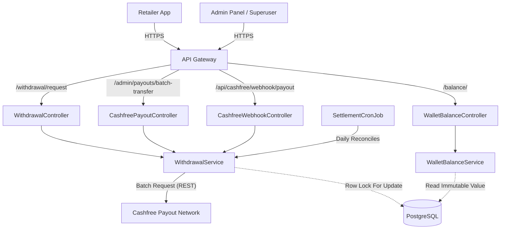
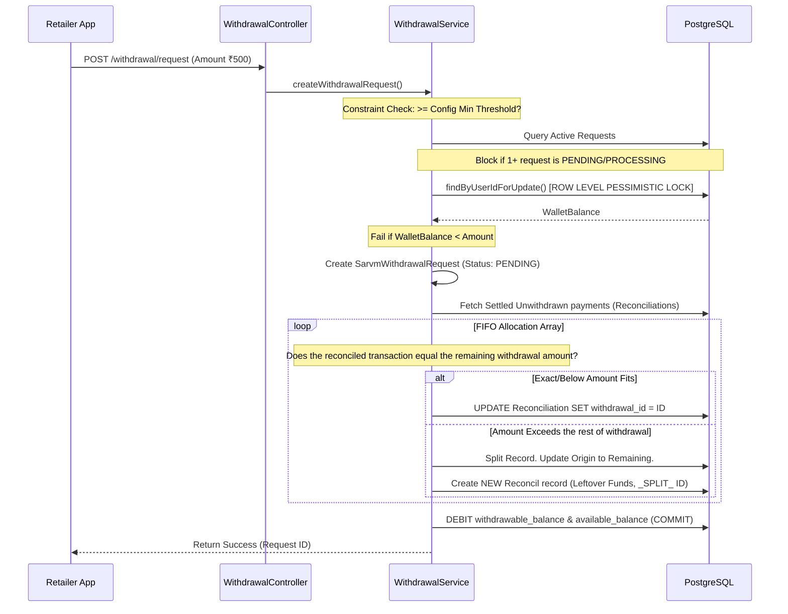
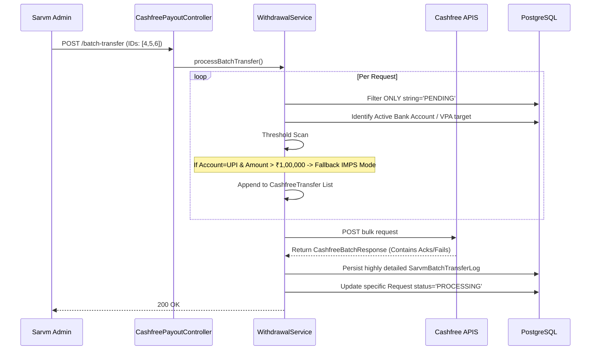
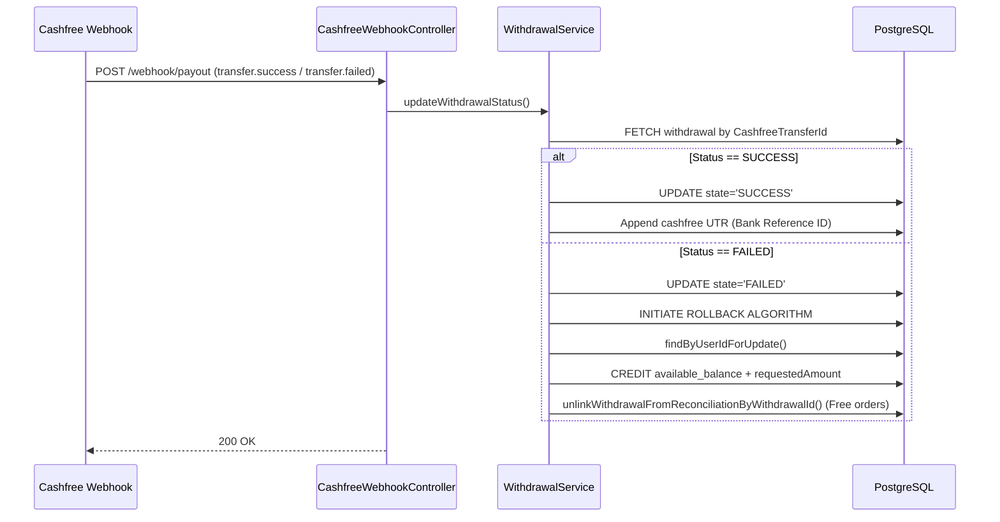

# Wallet Service - Deep Technical Architecture & Workflows

**Project**: Wallet Service (Underlying Package Structure: `com.sarvmai.referralreward`)
**Organization**: SARVM AI
**Stack**: Spring Boot, Java 11, PostgreSQL, Cashfree SDK, Spring Data JPA

---

## 1. Executive Summary

The **Wallet Service** operates as the central ledger out-bound settlement processor for the SARVM ecosystem. While external proxy microservices ingest funds natively via tools like Razorpay, the Wallet Service is strictly accountable for ledger validation, constraints mapping, and multi-tenant liquidity dispatching out of SARVM back into Retailer bank accounts.

Leveraging the **Cashfree Payouts API**, it calculates withdrawal algorithms against immutable balances, creates fractional splits natively linking settled payments, simulates mass batch transfers optimized for B2B payouts, handles bank webhooks, and rolls back virtual bounds upon transactional failures securely. 

## 2. Deep Component Architecture

The Wallet service introduces robust data security primitives focusing heavily on race-condition evasion specifically at the database level.

### Architecture Diagram



- **Routing Layer**: Exposes granular hooks (`/api/withdrawal/request`), payout executions (`/admin/payouts/batch-transfer`), and pure ledger readouts (`/balance/`).
- **Integration Layer**: Routes outgoing batch-transfers strictly to **Cashfree** (Specializing in IMPS/NEFT routing algorithms).
- **Service Layer (`WithdrawalService`)**: Executes complex FIFO transactional logic linking specific `SarvmPaymentReconciliation` records to the specific Withdrawal and validating bounds.

## 3. High-Fidelity Data Flow Workflows

### Workflow 1: Retailer Withdrawal Initiation & Transaction Splitting (PENDING)

This workflow maps the precise constraints executed instantly when a retailer says "Withdraw ₹X from my wallet". It doesn't just debit a number; it explicitly links the exact settled transactions mapping that balance to the outbound request.



**Key Technical Detail**: The fractional chunking mechanism (`_SPLIT_ {ID}`) enforces exact 1-to-1 traceability from a Cashfree payload back to an originally ingested user purchase.

### Workflow 2: Administrative Batch Processing (PROCESSING)

SARVM admins compile pending transactions into Cashfree Batch Payloads to avoid massive API rate limits on sequential requests.



### Workflow 3: Settled Payload Interception (SUCCESS | ROLLBACK)

Cashfree utilizes Webhooks to independently confirm successful NEFT/UPI bank reception asynchronously (from milliseconds to T+1 hours). 



## 4. Tech Stack Intricacies

- **Datastore Locking Mechanism**: Utilizes standard `@Transactional` wrappers paired locally with native `FOR UPDATE` PostgreSQL pessimistic row locks (`findByUserIdForUpdate`) ensuring absolute mathematical consensus.
- **External Integration Client**: Custom object mapping over `CashfreeWebhookRequest` & `CashfreeBatchResponse`.
- **Date Mechanics**: Converts natively across `OffsetDateTime` tracking precisely when bank acks drop vs when admins initialize processing.

## 5. Architectural Project Flow

```text
src/main/java/com/sarvmai/referralreward/
├── controller/        
│   ├── WithdrawalController.java        # Core Retailer Facing
│   ├── CashfreePayoutController.java    # Internal Operator Facing
│   └── CashfreeWebhookController.java   # M2M Banking Facing
├── service/           
│   └── WithdrawalService.java           # Central Logic Core (600+ LOCs)
├── entity/            
│   ├── SarvmWithdrawalRequest           # State machine entity
│   ├── SarvmBatchTransferLog            # Audit payload log
│   └── SarvmPaymentReconciliation       # Source-of-truth linkable payment mappings
├── repositories/      
│   ├── SarvmOnlinePaymentBalanceRepository # Employs standard row-locking mechanisms 
│   └── SarvmWithdrawalRequestRepository    
├── config/             # Injectible limits (MinThresholds) 
└── exception/          # Deeply bounded context threshold responses 
```

## 6. Granular Core Functionality

- **Database Pessimistic Locking**: Prevents all double-spend race conditions globally during `/api/withdrawal/request` via forcing PostgreSQL row locks on the retailer's balance entity.
- **Micro-transaction Splitting (FIFO Allocations)**: If a `Withdrawal Amount` consumes 2.5 historically settled purchases, the application surgically splits the 3rd `SarvmPaymentReconciliation` record marking half linked to the withdrawal and spawning an unlinked `leftover` instance.
- **Dynamic Bank Threshold Limiters**: Programmatically switches `PayoutMode` back down to foundational `IMPS` bounds if a user attempts to map a `UPI VPA` request over India's standard ₹1,00,000 threshold dynamically.
- **Batch Transfer Traceability**: Creates exhaustive `SarvmBatchTransferLog` entries detailing `totalTransfers`, `acknowledged`, `failedCount`, and `rawResponse` strings against the exact Cashfree bulk ID.
- **Atomic Rollbacks**: Complete reversal of balances and unlinking of exact split-associated historical payments upon Bank `transfer.failure`.

## 7. Granular API Definitions

**Exposed Endpoints**:
- `POST /api/withdrawal/request` -> Accepts `{"amount", "externalBeneficiaryId"}`. Performs the heavy FIFO isolation split and credits/debits the PGSQL Lock.
- `GET /api/withdrawal/history/{retailerId}/getWithdrawlRequestsHistory` -> Fetches all prior.
- `GET /api/withdrawal/{withdrawalId}/breakdown` -> Provides granular, per-order line-item breakdown linking exact historic consumer orders that culminated into the withdrawal grouping payload.
- `POST /admin/payouts/batch-transfer` -> Takes `List<withdrawalIds>`, processes the dynamic IMPS evaluation over the grouping, and fires it directly into the `api.cashfree.com/payout/transfers` proxy.
- `POST /api/cashfree/webhook/payout` -> Mutates internal status safely.

## 8. State Transitions (Enums & Machine)

`SarvmWithdrawalRequest.Status` Lifecycle Context:
1. **PENDING**: Balance is held internally. Not dispatched to external banks. Fully actionable.
2. **PROCESSING**: Dispatched to Cashfree via Batch. Awaiting Bank ACK. Irreversible via internal mechanics alone.
3. **SUCCESS**: Cleared the clearing-house mapping. Possesses definitive Network UTR keys.
4. **FAILED**: Failed downstream. The `WithdrawalService.rollbackWithdrawal` pipeline is forcibly executed to refund the balance back into `PENDING` states on the internal network allowing retailer retries.

## 9. Performance & Bottleneck Mitigations

- **Scalability Through Isolation**: Due to the severe pessimistic locking on active Retailer `balanceRepository.findByUserIdForUpdate`, two concurrent withdrawal taps logically wait out internal PGSQL sequencing ensuring impossible negative bounds. This heavily protects database state integrity at the cost of slight queuing on immense simultaneous loads.
- **Network Reduction**: By grouping payouts into lists inside the `CashfreePayoutController`, the internal Java environment skips spinning up 50 network `HttpUrlConnections` prioritizing 1 bulk stream.

## 10. Summary Extrapolations

The **Wallet Service** sets the high-watermark for structural integrity. The application treats its internal virtual values as inherently tethered to exact external realities, utilizing surgical logic constructs (`_SPLIT_` allocation cloning), robust Database Mutex boundaries (Pessimistic Write configurations), and granular Bulk Audit logs effectively allowing it to serve as a hardened Ledger environment.
